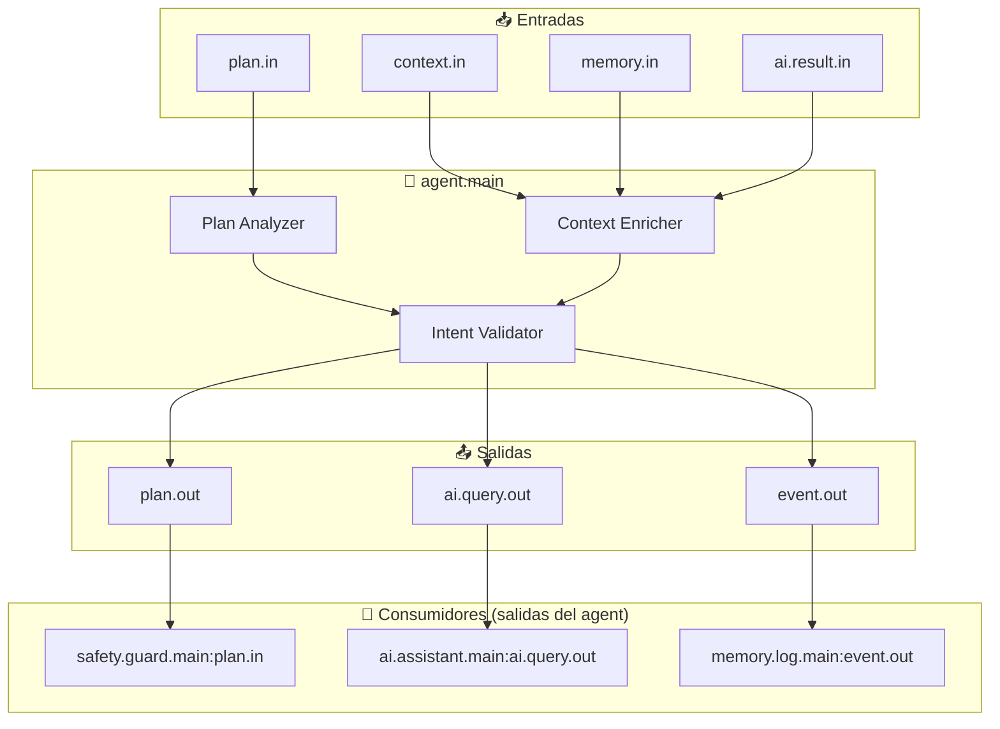

# Agent Module - Documentación

## 🤖 Intérprete de Intenciones

<p align="center">
  <b>Módulo core que enriquece planes con contexto, valida intenciones y coordina el flujo pre-ejecución</b>
</p>

---

## 📋 Índice

1. [Visión General](#visión-general)
2. [Arquitectura](#arquitectura)
3. [Flujo de Procesamiento](#flujo-de-procesamiento)
4. [Enriquecimiento de Planes](#enriquecimiento-de-planes)
5. [API y Puertos](#api-y-puertos)
6. [Validación de Intenciones](#validación-de-intenciones)
7. [Configuración](#configuración)
8. [Ejemplos](#ejemplos)
9. [Troubleshooting](#troubleshooting)

---

## Visión General

`agent.main` es el **enriquecedor de planes**. Recibe planes estructurados desde `planner.main`, los analiza en contexto, enriquece con información adicional (validaciones, preferencias del usuario, historial), y los envía al circuito de seguridad/aprobación.

### Responsabilidades

- 🧠 **Análisis de Planes**: Evalúa planes desde el planner
- 📚 **Enriquecimiento Contextual**: Agrega información de memoria y preferencias
- ✅ **Validación Preliminar**: Verifica que las acciones son válidas
- 🎯 **Salida a Safety**: Emite planes enriquecidos únicamente a safety.guard.main
- 🔄 **Feedback Loop**: Recibe retroalimentación y ajusta futuras interpretaciones

### Posición en la Arquitectura

```
┌─────────────────────────────────────────────────────────────────┐
│                    FLUJO REAL DEL AGENT                           │
├─────────────────────────────────────────────────────────────────┤
│                                                                  │
│   planner.main ──▶ agent.main ──▶ safety.guard.main              │
│                                        │                         │
│                                        ▼                         │
│                              [approval.main]                     │
│                              (solo si requiere aprobación)         │
│                                        │                         │
│                                        ▼                         │
│                                  router.main                     │
│                                                                  │
│   📌 AGENT solo ENRIQUECE y EMITE a safety.guard.main            │
│   📌 NO conecta directamente a router ni approval                 │
│   📌 El flujo post-safety es responsabilidad del safety/approval │
│                                                                  │
└─────────────────────────────────────────────────────────────────┘
```

---

## Arquitectura

### Diagrama de Conexiones



### Tabla de Conexiones

| Puerto | Dirección | Origen/Destino | Descripción |
|--------|-----------|----------------|-------------|
| `plan.in` | Entrada | `planner.main` | Planes para enriquecer |
| `context.in` | Entrada | `guide.main`, `ui.state.main` | Contexto de ejecución |
| `memory.in` | Entrada | `memory.log.main`, `ai.memory.semantic.main` | Historial y preferencias |
| `ai.result.in` | Entrada | `ai.assistant.main` | Resultados de consultas IA |
| `plan.out` | Salida | `safety.guard.main:plan.in` | **ÚNICA salida de plan** - va a seguridad |
| `ai.query.out` | Salida | `ai.assistant.main` | Consultas para análisis semántico |
| `event.out` | Salida | `memory.log.main` | Eventos de procesamiento |

> **⚠️ NOTA**: El agent NO conecta directamente a router.main ni approval.main. El flujo post-agent es: agent → safety → [approval] → router.

---

## Flujo de Procesamiento

### Proceso de Enriquecimiento

```
1. RECEPCIÓN DE PLAN
   plan.in desde planner.main
   {
     "plan_id": "plan_123",
     "steps": [...],
     "confidence": 0.85
   }
           │
           ▼
2. ANÁLISIS DE CONTEXTO
   - ¿Usuario tiene preferencias para esta acción?
   - ¿Hubo comandos similares recientemente?
   - ¿Requiere aprobación explícita?
           │
           ▼
3. CONSULTA A IA (opcional)
   Si confidence < 0.9:
     ai.query.out → ai.assistant.main
     "Analizar si este plan es correcto para el comando"
           │
           ▼
4. ENRIQUECIMIENTO
   - Agregar preferencias del usuario
   - Incluir contexto conversacional
   - Marcar si requiere aprobación
   - Calcular riesgo de seguridad
           │
           ▼
5. VALIDACIÓN
   - ¿Acciones soportadas por workers?
   - ¿Parámetros válidos?
   - ¿Permisos suficientes?
           │
           ▼
6. EMISIÓN
   plan.out → safety.guard.main
   
   > 📌 El agent NO emite a supervisor.main. El supervisor recibe eventos
   >    de observación por broadcast separado, no como destinatario del plan.
```

---

## Enriquecimiento de Planes

### Campos Agregados

| Campo | Descripción | Ejemplo |
|-------|-------------|---------|
| `user_preferences` | Preferencias aprendidas | `{"browser": "firefox", "editor": "vscode"}` |
| `context_history` | Comandos recientes | `["abrir chrome", "navegar a github"]` |
| `requires_approval` | Necesita confirmación | `true` para acciones destructivas |
| `risk_level` | Nivel de riesgo | `low`, `medium`, `high`, `critical` |
| `suggested_alternatives` | Alternativas posibles | `["chrome", "firefox"]` para "abrir navegador" |
| `ai_enhanced` | Plan mejorado por IA | `true` si IA sugirió cambios |

### Ejemplo de Plan Enriquecido

**Entrada** (desde planner):
```json
{
  "plan_id": "plan_001",
  "kind": "single_step",
  "steps": [{
    "action": "open_application",
    "params": {"name": "browser"}
  }],
  "confidence": 0.75
}
```

**Salida** (hacia safety.guard.main):
```json
{
  "plan_id": "plan_001",
  "kind": "single_step",
  "steps": [{
    "action": "open_application",
    "params": {
      "name": "firefox",
      "command": "firefox"
    }
  }],
  "confidence": 0.95,
  "enriched": true,
  "user_preferences": {
    "preferred_browser": "firefox",
    "reason": "Aprendido de comandos previos"
  },
  "requires_approval": false,
  "risk_level": "low",
  "ai_enhanced": true
}
```

---

## API y Puertos

### Entrada: `plan.in`

**Schema**:
```json
{
  "plan_id": "plan_1234567890",
  "kind": "single_step|multi_step",
  "original_command": "abrir navegador",
  "steps": [...],
  "confidence": 0.75,
  "trace_id": "abc-123-trace",
  "meta": {
    "source": "telegram",
    "chat_id": 123456789,
    "timestamp": "2026-01-01T00:00:00Z"
  }
}
```

### Salida: `plan.out` (enriquecido)

**Schema**:
```json
{
  "plan_id": "plan_1234567890",
  "kind": "single_step|multi_step",
  "original_command": "abrir navegador",
  "steps": [...],
  "confidence": 0.95,
  "enriched": true,
  "requires_approval": false,
  "risk_level": "low",
  "user_preferences_applied": [...],
  "context_history": [...],
  "estimated_duration_ms": 3500,
  "ai_analysis": {
    "enhanced": true,
    "confidence_delta": 0.20,
    "suggestion": "Usar firefox basado en historial"
  },
  "trace_id": "abc-123-trace",
  "meta": {
    "enriched_by": "agent.main",
    "timestamp": "2026-01-01T00:00:01Z"
  }
}
```

### Salida: `ai.query.out`

**Schema** (consulta opcional a IA):
```json
{
  "query_id": "query_123",
  "prompt": "Analizar si este plan es apropiado: abrir aplicación 'browser'",
  "context": {
    "user_history": [...],
    "current_plan": {...}
  },
  "trace_id": "abc-123-trace"
}
```

---

## Validación de Intenciones

### Niveles de Riesgo

| Nivel | Criterios | Requiere Aprobación |
|-------|-----------|---------------------|
| `low` | Abrir apps, navegar web, búsquedas | No |
| `medium` | Ejecutar comandos de terminal, borrar archivos | Opcional |
| `high` | Instalar software, modificar configuración | Sí |
| `critical` | Formatear, eliminar datos sensibles, acceso root | Sí + confirmación extra |

### Reglas de Validación

```javascript
function validateIntent(plan) {
  const risks = [];
  
  // 1. Validar acciones conocidas
  for (const step of plan.steps) {
    if (!isKnownAction(step.action)) {
      risks.push(`Acción desconocida: ${step.action}`);
    }
  }
  
  // 2. Detectar acciones destructivas
  if (hasDestructiveActions(plan)) {
    plan.requires_approval = true;
    plan.risk_level = 'high';
  }
  
  // 3. Verificar permisos necesarios
  if (requiresElevatedPermissions(plan)) {
    plan.requires_approval = true;
    plan.risk_level = 'critical';
  }
  
  // 4. Consultar IA si confidence bajo
  if (plan.confidence < 0.8) {
    return requestAIValidation(plan);
  }
  
  return { valid: risks.length === 0, risks };
}
```

### Acciones Destructivas

| Acción | Nivel de Riesgo | Requiere Aprobación |
|--------|-----------------|---------------------|
| `delete_file` | high | Sí |
| `format_drive` | critical | Sí + confirmación |
| `install_package` | medium | Opcional |
| `modify_config` | medium | Opcional |
| `terminal.write_command` con `sudo` | high | Sí |

---

## Configuración

### Manifest (`modules/agent/manifest.json`)

```json
{
  "id": "agent.main",
  "name": "Intérprete de Intenciones",
  "version": "1.0.0",
  "description": "Enriquece planes con contexto y valida intenciones",
  "tier": "core",
  "priority": "high",
  "restart_policy": "immediate",
  "language": "node",
  "entry": "main.js",
  "inputs": [
    "plan.in",
    "context.in",
    "memory.in",
    "ai.result.in",
    "feedback.in"
  ],
  "outputs": [
    "plan.out",
    "ai.query.out",
    "event.out",
    "memory.out"
  ],
  "config": {
    "confidence_threshold": 0.8,
    "ai_consultation_threshold": 0.75,
    "risk_levels": {
      "low": {"approval": false},
      "medium": {"approval": "optional"},
      "high": {"approval": true},
      "critical": {"approval": true, "double_confirm": true}
    },
    "learning_enabled": true
  }
}
```

---

## Ejemplos

### Ejemplo 1: Enriquecimiento Simple

**Entrada**:
```json
{
  "plan_id": "plan_001",
  "steps": [{
    "action": "open_application",
    "params": {"name": "editor"}
  }],
  "confidence": 0.70
}
```

**Contexto de memoria**:
```json
{
  "user_preferences": {
    "preferred_editor": "vscode"
  }
}
```

**Salida**:
```json
{
  "plan_id": "plan_001",
  "steps": [{
    "action": "open_application",
    "params": {"name": "vscode"}
  }],
  "confidence": 0.92,
  "enriched": true,
  "user_preferences_applied": ["editor -> vscode"]
}
```

### Ejemplo 2: Detección de Riesgo

**Entrada**:
```json
{
  "plan_id": "plan_002",
  "steps": [{
    "action": "delete_file",
    "params": {"path": "/home/user/documentos"}
  }]
}
```

**Salida**:
```json
{
  "plan_id": "plan_002",
  "steps": [...],
  "requires_approval": true,
  "risk_level": "high",
  "approval_reason": "Acción destructiva: eliminar directorio",
  "user_message": "⚠️ Esta acción eliminará archivos. ¿Desea continuar?"
}
```

### Ejemplo 3: Consulta a IA

**Entrada**:
```json
{
  "plan_id": "plan_003",
  "steps": [{
    "action": "open_application",
    "params": {"name": "gestor"}
  }],
  "confidence": 0.60
}
```

**Consulta generada** (`ai.query.out`):
```json
{
  "query_id": "query_003",
  "prompt": "El usuario quiere abrir 'gestor'. ¿A qué aplicación se refiere? Opciones: file_manager, task_manager, password_manager",
  "context": {
    "recent_commands": ["buscar archivos", "organizar carpetas"]
  }
}
```

---

## Troubleshooting

### Problemas Comunes

| Problema | Causa | Solución |
|----------|-------|----------|
| "Plan ambiguo" | Confidence bajo en planner | Consultar IA para clarificación |
| "Preferencia no aplicada" | Memoria no disponible | Verificar conexión con ai.memory.semantic |
| "Falso positivo de riesgo" | Reglas de riesgo muy estrictas | Ajustar thresholds en config |
| "IA timeout" | Consulta a IA lenta | Implementar fallback rápido |

### Debug

```javascript
// Log de enriquecimiento
emit("event.out", {
  "level": "debug",
  "type": "agent_enrichment",
  "plan_id": planId,
  "original_confidence": originalConfidence,
  "final_confidence": finalConfidence,
  "preferences_applied": preferences,
  "risk_assessment": riskLevel
});
```

---

## Referencias

- **[PLANNER.md](PLANNER.md)** - Planificador de comandos
- **[SAFETY_GUARD.md](SAFETY_GUARD.md)** - Validación de seguridad
- **[APPROVAL.md](APPROVAL.md)** - Circuito de aprobaciones
- **[AI_CAPABILITIES.md](AI_CAPABILITIES.md)** - IA para análisis semántico

---

<p align="center">
  <b>Agent Module v1.0.0</b><br>
  <sub>Intérprete de intenciones - Core del sistema</sub>
</p>
