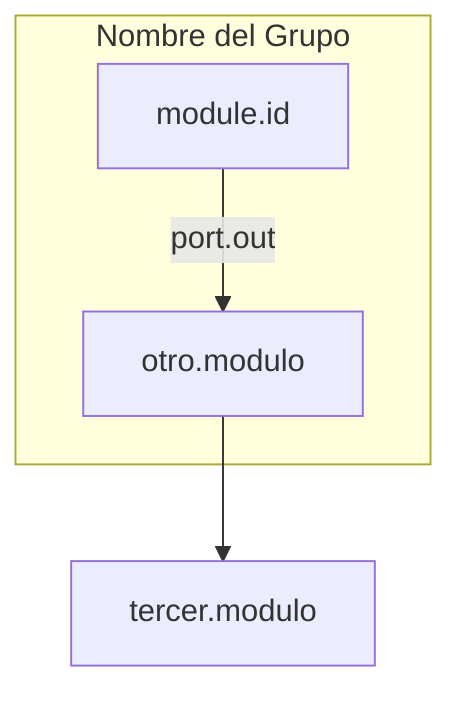
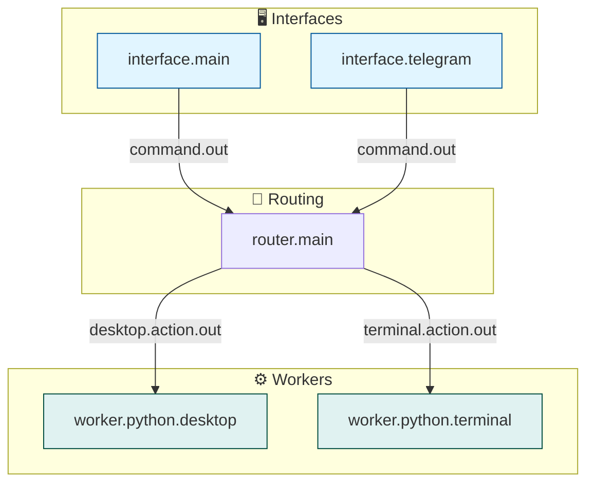

# Blueprint Flow Inspector - Documentación

## 🕸️ Análisis CLI de Arquitectura Modular

<p align="center">
  <b>Herramienta de análisis y visualización de conexiones del sistema blueprint-v0</b>
</p>

---

## 📋 Índice

1. [Visión General](#visión-general)
2. [Instalación](#instalación)
3. [Comandos](#comandos)
4. [Ejemplos de Uso](#ejemplos-de-uso)
5. [Casos de Uso Prácticos](#casos-de-uso-prácticos)
6. [Arquitectura Interna](#arquitectura-interna)
7. [Formato de Diagrama Mermaid](#formato-de-diagrama-mermaid)
8. [Integración con CI/CD](#integración-con-cicd)
9. [Troubleshooting](#troubleshooting)

---

## Visión General

El **Blueprint Flow Inspector** es una herramienta CLI en Python que permite analizar, inspeccionar y visualizar las conexiones de la arquitectura modular de blueprint-v0. Extrae información desde diagramas Mermaid y proporciona insights sobre el flujo de datos entre módulos.

### Características Principales

| Característica | Descripción |
|----------------|-------------|
| 📊 **Resumen de Grafo** | Estadísticas de nodos, conexiones, fan-in/fan-out |
| 🔍 **Tracing** | Seguimiento de flujos por categoría (command, event, result) |
| 🛤️ **Shortest Path** | Rutas más cortas entre cualquier par de módulos |
| 📈 **DataOps Paths** | Escenarios predefinidos de flujos de datos |
| 🔎 **Module Report** | Entradas y salidas detalladas de un módulo |
| 📤 **JSON Export** | Salida estructurada para integración |

---

## Instalación

No requiere instalación adicional. Solo dependencias del sistema base:

```bash
# Dependencias Python estándar utilizadas:
- argparse
- json
- re (expresiones regulares)
- collections (Counter, defaultdict, deque)
- dataclasses
- pathlib
- typing
```

### Ubicación

```
blue-arrow/
├── blueprint_flow_inspector.py  # ← Este archivo
├── docs/
│   └── system-architecture-diagram.md  # Diagrama a analizar
└── ...
```

---

## Comandos

### Sintaxis General

```bash
python3 blueprint_flow_inspector.py <archivo-diagrama> <comando> [opciones]
```

### 1. Summary - Resumen del Grafo

Muestra estadísticas generales del sistema.

```bash
python3 blueprint_flow_inspector.py docs/system-architecture-diagram.md summary
```

**Opciones:**
- `--json` - Salida en formato JSON

**Ejemplo de Salida:**
```
Módulos: 33
Conexiones: 104

Top fan-out:
id                | label                     | count
------------------+---------------------------+-------
router.main       | router.main               | 12
agent.main        | agent.main                | 8
supervisor.main   | supervisor.main           | 7

Top fan-in:
id                | label                     | count
------------------+---------------------------+-------
memory.log.main   | memory.log.main           | 23
interface.telegram| interface.telegram        | 9
guide.main        | guide.main                | 6

Categorías de flujo:
category    | count
------------+-------
command     | 24
event       | 56
result      | 18
plan        | 6
```

### 2. Trace - Seguimiento de Flujos

Traza conexiones desde o hacia un módulo específico.

```bash
# Trazar salidas desde un módulo
python3 blueprint_flow_inspector.py diagram.md trace \
  --direction from \
  --module router.main \
  --depth 3

# Trazar entradas hacia un módulo
python3 blueprint_flow_inspector.py diagram.md trace \
  --direction to \
  --module memory.log.main \
  --depth 2 \
  --category event
```

**Opciones:**
- `--direction {from,to}` - Dirección del trazado (requerido)
- `--module <nombre>` - Módulo origen/destino (requerido)
- `--depth <n>` - Profundidad máxima (default: 5)
- `--category <tipo>` - Filtrar por categoría (command, event, result, plan)
- `--json` - Salida en JSON

**Ejemplo de Salida:**
```
depth | from            | port              | to
------+-----------------+-------------------+----------------
1     | router.main     | desktop.action.out| worker.python.desktop
1     | router.main     | terminal.action.out| worker.python.terminal
1     | router.main     | event.out         | memory.log.main
2     | worker.python.desktop | result.out    | verifier.engine.main
```

### 3. Path - Camino Más Corto

Encuentra la ruta más corta entre dos módulos.

```bash
python3 blueprint_flow_inspector.py diagram.md path \
  --from-module interface.telegram \
  --to-module worker.python.desktop
```

**Opciones:**
- `--from-module <nombre>` - Módulo origen (requerido)
- `--to-module <nombre>` - Módulo destino (requerido)
- `--category <tipo>` - Filtrar por categoría
- `--json` - Salida en JSON

**Ejemplo de Salida:**
```
from                    | port              | to
------------------------+-------------------+------------------------
interface.telegram      | command.out       | planner.main
planner.main            | command.out       | guide.main
guide.main              | command.out       | agent.main
agent.main              | plan.out          | router.main
router.main             | desktop.action.out| worker.python.desktop
```

### 4. Module - Reporte de Módulo

Detalle completo de entradas y salidas de un módulo.

```bash
python3 blueprint_flow_inspector.py diagram.md module \
  --module office.writer.main
```

**Opciones:**
- `--module <nombre>` - Nombre del módulo (requerido)
- `--json` - Salida en JSON

**Ejemplo de Salida:**
```
Módulo: office.writer.main (office.writer.main)
Capa: Automatización
Entradas: 3
Salidas: 5

Entradas:
from                    | port              | category
------------------------+-------------------+----------
router.main             | office.action.out | command
worker.python.desktop   | result.out        | result
ai.assistant.main       | result.out        | result

Salidas:
to                      | port              | category
------------------------+-------------------+----------
worker.python.desktop   | desktop.action.out| command
ai.assistant.main       | ai.action.out     | command
interface.telegram      | ui.response.out   | result
memory.log.main         | event.out         | event
supervisor.main         | result.out        | result
```

### 5. DataOps - Escenarios Predefinidos

Muestra caminos predefinidos para escenarios comunes de datos.

```bash
python3 blueprint_flow_inspector.py diagram.md dataops
```

**Opciones:**
- `--json` - Salida en JSON

**Escenarios Incluidos:**

| Escenario | Descripción |
|-----------|-------------|
| `telegram_command_to_execution` | Flujo completo: Telegram → Ejecución |
| `telegram_command_to_terminal` | Comandos de terminal desde Telegram |
| `telegram_command_to_browser` | Navegación web desde Telegram |
| `router_to_verification` | Verificación de ejecución |
| `office_writer_roundtrip` | Flujo completo Office Writer |
| `execution_feedback_to_user` | Feedback al usuario post-ejecución |
| `execution_feedback_to_memory` | Persistencia de resultados |

---

## Ejemplos de Uso

### Análisis de Impacto de un Módulo

Ver qué módulos se ven afectados si falla `router.main`:

```bash
python3 blueprint_flow_inspector.py diagram.md trace \
  --direction from \
  --module router.main \
  --depth 2
```

### Debugging de Conexiones

Verificar que `office.writer.main` tiene todas las conexiones necesarias:

```bash
python3 blueprint_flow_inspector.py diagram.md module \
  --module office.writer.main \
  --json | jq '.incoming, .outgoing'
```

### Optimización de Rutas

Encontrar el camino más corto para comandos de terminal:

```bash
python3 blueprint_flow_inspector.py diagram.md path \
  --from-module interface.main \
  --to-module worker.python.terminal \
  --category command
```

### Exportar para Dashboard

Generar JSON para integración con herramientas de visualización:

```bash
python3 blueprint_flow_inspector.py diagram.md summary --json > system_metrics.json
```

---

## Casos de Uso Prácticos

### 1. Verificar Nuevo Módulo

Al agregar un nuevo módulo, verificar sus conexiones:

```bash
# Verificar que el módulo está en el diagrama
python3 blueprint_flow_inspector.py diagram.md summary | grep "office.writer"

# Verificar entradas y salidas
python3 blueprint_flow_inspector.py diagram.md module \
  --module office.writer.main

# Verificar que hay rutas desde interfaces
python3 blueprint_flow_inspector.py diagram.md path \
  --from-module interface.telegram \
  --to-module office.writer.main
```

### 2. Análisis de Cuello de Botella

Identificar módulos con alto fan-in (muchos dependen de ellos):

```bash
python3 blueprint_flow_inspector.py diagram.md summary | grep -A 20 "Top fan-in"
```

### 3. Documentación Automática

Generar documentación de rutas de datos:

```bash
#!/bin/bash
# generate_data_flow_docs.sh

echo "# Flujos de Datos del Sistema" > DATA_FLOWS.md
echo "" >> DATA_FLOWS.md

python3 blueprint_flow_inspector.py diagram.md dataops --json | \
  jq -r 'keys[] as $k | "## \($k)\n\(.[$k] | map("- \(.from) → \(.to) (\(.port))") | join("\n"))\n"' \
  >> DATA_FLOWS.md
```

### 4. CI/CD Integration

Verificar integridad del diagrama en CI:

```yaml
# .github/workflows/validate-diagram.yml
jobs:
  validate-architecture:
    runs-on: ubuntu-latest
    steps:
      - uses: actions/checkout@v3
      
      - name: Validate diagram syntax
        run: |
          python3 blueprint_flow_inspector.py \
            docs/system-architecture-diagram.md summary
      
      - name: Check all modules have connections
        run: |
          # Verificar que no hay módulos huérfanos
          python3 blueprint_flow_inspector.py diagram.md summary --json | \
            jq '.sources | length' | grep -v "^0$"
```

---

## Arquitectura Interna

### Clases Principales

```python
@dataclass
class Edge:
    source_id: str      # ID del nodo origen
    source_label: str   # Etiqueta legible del origen
    port: str          # Puerto de conexión
    target_id: str      # ID del nodo destino
    target_label: str   # Etiqueta legible del destino
    source_group: str | None  # Grupo/subgraph origen
    target_group: str | None  # Grupo/subgraph destino

    def category(self) -> str:
        """Categoriza la conexión (command, event, result, etc.)"""
```

### Parser de Mermaid

```python
class MermaidFlowParser:
    def __init__(self, text: str)
    def extract_mermaid(self) -> str  # Extrae bloque mermaid
    def parse(self) -> 'MermaidFlowParser'  # Parsea nodos y aristas
    # Atributos:
    # - nodes: dict[id, label]
    # - groups: dict[id, label]
    # - node_group: dict[node_id, group_id]
    # - edges: list[Edge]
```

### Grafo de Flujo

```python
class FlowGraph:
    def __init__(self, parser: MermaidFlowParser)
    
    # Métodos de navegación:
    def trace_from(self, start: str, depth: int, category: str | None) -> list[dict]
    def trace_to(self, target: str, depth: int, category: str | None) -> list[dict]
    def shortest_path(self, source: str, target: str, category: str | None) -> list[dict]
    
    # Métodos de análisis:
    def summary(self) -> dict
    def module_report(self, name: str) -> dict
    def dataops_paths(self) -> dict[str, list[dict]]
    
    # Utilidades:
    def resolve(self, name: str) -> str  # Resuelve nombre a ID
```

### Expresiones Regulares

```python
NODE_RE = re.compile(r'^\s*([A-Za-z0-9_]+)\["([^"]+)"\]\s*$')
EDGE_RE = re.compile(r'^\s*([A-Za-z0-9_]+)\s*-->(?:\|([^|]+)\|)?\s*([A-Za-z0-9_]+)\s*$')
SUBGRAPH_RE = re.compile(r'^\s*subgraph\s+([A-Za-z0-9_]+)\["([^"]+)"\]\s*$')
CLASS_RE = re.compile(r'^\s*class\s+(.+?)\s+([A-Za-z0-9_]+)\s*$')
MERMAID_BLOCK_RE = re.compile(r'```mermaid\n(.*?)```', re.DOTALL)
```

---

## Formato de Diagrama Mermaid

El inspector espera diagramas Mermaid con el siguiente formato:



### Elementos Soportados

| Elemento | Sintaxis | Ejemplo |
|----------|----------|---------|
| Nodo | `ID["label"]` | `ROUTER["router.main"]` |
| Arista simple | `A --> B` | `ROUTER --> WORKER` |
| Arista con puerto | `A -->\|port.out\| B` | `ROUTER -->\|desktop.action.out\| WORKER` |
| Subgraph | `subgraph ID["label"]` | `subgraph Workers["⚙️ Workers"]` |
| Direction | `direction TB` | `direction TB` dentro de subgraph |
| Classes | `class A,B style` | `class ROUTER worker` |

### Ejemplo Completo



---

## Integración con CI/CD

### GitHub Actions

```yaml
name: Validate Architecture

on: [push, pull_request]

jobs:
  validate:
    runs-on: ubuntu-latest
    steps:
      - uses: actions/checkout@v3
      
      - name: Setup Python
        uses: actions/setup-python@v4
        with:
          python-version: '3.11'
      
      - name: Validate Architecture Diagram
        run: |
          python3 blueprint_flow_inspector.py \
            docs/system-architecture-diagram.md summary --json | \
            jq -e '.total_nodes > 0 and .total_edges > 0'
      
      - name: Check Module Connections
        run: |
          # Verificar que todos los módulos del blueprint tienen conexiones
          for module in $(jq -r '.modules[]' blueprints/system.v0.json); do
            echo "Checking $module..."
            python3 blueprint_flow_inspector.py \
              docs/system-architecture-diagram.md module \
              --module "$module" --json | \
              jq -e '(.incoming_count + .outgoing_count) > 0' || exit 1
          done
```

### Pre-commit Hook

```yaml
# .pre-commit-config.yaml
repos:
  - repo: local
    hooks:
      - id: validate-architecture
        name: Validate Architecture
        entry: python3 blueprint_flow_inspector.py
        args: [docs/system-architecture-diagram.md, summary]
        language: system
        pass_filenames: false
        always_run: true
```

---

## Troubleshooting

### Problemas Comunes

| Problema | Causa | Solución |
|----------|-------|----------|
| "No encontré un bloque mermaid" | No hay bloque ```mermaid en el archivo | Verificar formato del diagrama |
| "Ambiguo: X puede ser Y, Z" | Nombres similares en nodos | Usar ID exacto del nodo |
| Módulo no encontrado | Nombre incorrecto o no existe | Verificar lista de módulos |
| Sin resultados en trace | Profundidad muy baja | Aumentar `--depth` |

### Debug

Habilitar información de debug:

```bash
# Ver estructura interna del parser
python3 -c "
import sys
sys.path.insert(0, '.')
from blueprint_flow_inspector import MermaidFlowParser, FlowGraph

parser = MermaidFlowParser(open('diagram.md').read()).parse()
print('Nodes:', parser.nodes)
print('Edges:', len(parser.edges))
print('Groups:', parser.groups)
"
```

### Formato de Salida JSON

```json
{
  "total_nodes": 33,
  "total_edges": 104,
  "sources": [
    {"id": "IF_MAIN", "label": "interface.main"}
  ],
  "sinks": [
    {"id": "MEM_LOG", "label": "memory.log.main"}
  ],
  "top_fanout": [
    {"id": "ROUTER", "label": "router.main", "count": 12}
  ],
  "category_counts": {
    "command": 24,
    "event": 56,
    "result": 18,
    "plan": 6
  }
}
```

---

## Roadmap

### Completado ✅
- [x] Parser de diagramas Mermaid
- [x] Análisis de nodos y conexiones
- [x] Trazado bidireccional (from/to)
- [x] Shortest path entre módulos
- [x] Categorización de puertos
- [x] Escenarios DataOps predefinidos
- [x] Exportación JSON
- [x] Resumen con fan-in/fan-out

### Futuro 🚧
- [ ] Visualización gráfica interactiva
- [ ] Comparación de versiones de diagrama
- [ ] Detección de ciclos
- [ ] Métricas de complejidad
- [ ] Exportar a otros formatos (DOT, PlantUML)
- [ ] Autocompletado de nombres de módulos
- [ ] Sugerencias de optimización de rutas

---

## Referencias

- **[ARCHITECTURE.md](ARCHITECTURE.md)** - Arquitectura del sistema
- **[system.v0.json](../blueprints/system.v0.json)** - Blueprint de conexiones
- **[OFFICE_WRITER.md](OFFICE_WRITER.md)** - Ejemplo de módulo documentado

---

<p align="center">
  <b>Blueprint Flow Inspector</b><br>
  <sub>Herramienta de análisis de arquitectura modular</sub>
</p>
