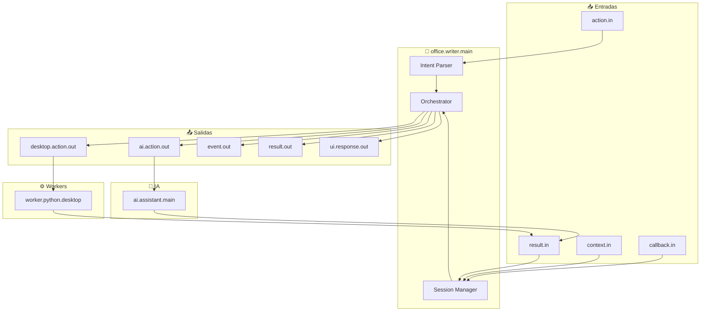

# Office Writer Module - Documentación

## 📝 Automatización de LibreOffice Writer con IA

<p align="center">
  <b>Módulo de orquestación para abrir documentos, redactar con IA y escribir texto automáticamente</b>
</p>

---

## 📋 Índice

1. [Visión General](#visión-general)
2. [Arquitectura](#arquitectura)
3. [Flujo de Trabajo](#flujo-de-trabajo)
4. [API y Comandos](#api-y-comandos)
5. [Conexiones](#conexiones)
6. [Manejo de Sesiones](#manejo-de-sesiones)
7. [Configuración](#configuración)
8. [Ejemplos de Uso](#ejemplos-de-uso)
9. [Troubleshooting](#troubleshooting)

---

## Visión General

El módulo `office.writer.main` orquesta la automatización completa de **LibreOffice Writer** con integración de IA local (LLaMA via Ollama). Permite a los usuarios abrir Writer, generar contenido con IA y escribirlo automáticamente en el documento.

### Casos de Uso

- 🖊️ **Abrir Writer** - Abrir LibreOffice Writer con un solo comando
- 🤖 **Redactar con IA** - Generar cartas, documentos, notas usando LLaMA
- 📝 **Escritura Automática** - Escribir texto generado directamente en el documento
- 🔄 **Flujo Completo** - "abrir writer y escribir una carta de presentación"

### 🔒 Autoridad del Módulo

`office.writer.main` es un **orquestador compuesto** que coordina un flujo multi-paso (abrir → generar → escribir) y emite un **resultado final único** al supervisor.

**Semántica de cierre:**
- Los workers individuales (`worker.python.desktop`, `ai.assistant.main`) **informan** resultados parciales a `office.writer.main` vía `result.in`
- `office.writer.main` **compone** estos resultados y emite **un solo** `result.out` al supervisor cuando el flujo completo termina
- El supervisor es el único closer oficial del sistema

**Diferencia con workers simples:**
| Aspecto | Worker Simple | Office Writer (Orquestador) |
|---------|---------------|----------------------------|
| Resultado | Informa resultado directo | Compone resultado de flujo multi-paso |
| Cierre | Supervisor cierra | Supervisor cierra (con resultado compuesto) |
| Observadores | Reciben `event.out` | Reciben `event.out` del orquestador |

**Regla aplicada**: El orquestador sigue el patrón de **cierre único** - solo emite `result.out` al supervisor cuando todo el flujo (abrir + generar + escribir) se completa exitosamente o falla.

---

## Arquitectura

```
┌─────────────────────────────────────────────────────────────────────────┐
│                         OFFICE WRITER ARCHITECTURE                       │
├─────────────────────────────────────────────────────────────────────────┤
│                                                                          │
│  ┌─────────────────┐                                                    │
│  │  User Command   │  "abrir writer y redactar una carta formal"        │
│  └────────┬────────┘                                                    │
│           │                                                              │
│           ▼                                                              │
│  ┌─────────────────────────────────────────────────────────────────┐    │
│  │                    office.writer.main                            │    │
│  │  ┌─────────────┐  ┌─────────────┐  ┌─────────────────────────┐ │    │
│  │  │   Session   │  │  Intent     │  │   State Management      │ │    │
│  │  │   Manager   │  │  Parser     │  │  (waiting_open/ai/write)│ │    │
│  │  └─────────────┘  └─────────────┘  └─────────────────────────┘ │    │
│  └────────┬──────────────────────────────────────────────────────┘    │
│           │                                                              │
│     ┌─────┴─────┬────────────────┐                                       │
│     ▼           ▼                ▼                                       │
│ ┌────────┐ ┌────────┐     ┌────────────┐                                │
│ │desktop │ │   ai   │     │  ui.response│                                │
│ │.action │ │.action │     │    .out     │                                │
│ │  .out  │ │  .out  │     └────────────┘                                │
│ └────┬───┘ └───┬────┘                                                  │
│      │         │                                                         │
│      ▼         ▼                                                         │
│ ┌──────────────────┐  ┌──────────────────┐                             │
│ │ worker.python    │  │ ai.assistant     │                             │
│ │    .desktop      │  │    .main         │                             │
│ │                  │  │                  │                             │
│ │  - open_writer   │  │  - ai.query      │                             │
│ │  - write_text    │  │  - generate_text │                             │
│ └────────┬─────────┘  └────────┬─────────┘                             │
│          │                     │                                        │
│          └──────────┬──────────┘                                       │
│                     ▼                                                   │
│           ┌─────────────────┐                                          │
│           │  result.in      │  ◄── Resultados de workers/IA            │
│           │  (callback)     │                                          │
│           └─────────────────┘                                          │
│                                                                          │
└─────────────────────────────────────────────────────────────────────────┘
```

---

## Flujo de Trabajo

### Flujo Completo: Abrir + Redactar + Escribir

```
Usuario: "abrir writer y escribir una carta de presentación"

┌─────────┐     ┌─────────────────┐     ┌─────────────────┐     ┌─────────┐
│  PASO 1 │────▶│     PASO 2      │────▶│     PASO 3      │────▶│  PASO 4 │
│  Abrir  │     │  Generar Texto  │     │  Escribir Texto │     │ Confirm │
│ Writer  │     │    con IA       │     │  en Documento   │     │  Result │
└────┬────┘     └────────┬────────┘     └────────┬────────┘     └────┬────┘
     │                   │                       │                   │
     │                   │                       │                   │
     ▼                   ▼                       ▼                   ▼
┌─────────────────────────────────────────────────────────────────────────┐
│ 1. Emite: desktop.action.out                                            │
│    {                                                                    │
│      "task_id": "task_123__open",                                       │
│      "action": "office.open_writer",                                    │
│      "params": {                                                        │
│        "app": "writer",                                                 │
│        "command": "libreoffice --writer"                               │
│      }                                                                  │
│    }                                                                    │
│                                                                         │
│ 2. Recibe: result.in (window_id confirmado)                            │
│    → Guarda window_id en sesión                                         │
│    → Estado: waiting_ai = true                                         │
│                                                                         │
│ 3. Emite: ai.action.out                                                 │
│    {                                                                    │
│      "task_id": "task_123__ai",                                         │
│      "action": "ai.query",                                               │
│      "params": {                                                        │
│        "prompt": "Redactá en español... Pedido: carta de presentación"  │
│      }                                                                  │
│    }                                                                    │
│                                                                         │
│ 4. Recibe: result.in (texto generado)                                   │
│    → Guarda draft_text en sesión                                       │
│    → Estado: waiting_write = true                                      │
│                                                                         │
│ 5. Emite: desktop.action.out                                            │
│    {                                                                    │
│      "task_id": "task_123__write",                                      │
│      "action": "office.write_text",                                     │
│      "params": {                                                        │
│        "text": "<texto generado por IA>",                              │
│        "window_id": "0x04200001",                                       │
│        "app": "writer"                                                  │
│      }                                                                  │
│    }                                                                    │
│                                                                         │
│ 6. Recibe: result.in (éxito)                                           │
│    → Emite: ui.response.out                                            │
│    → Resetea sesión                                                    │
└─────────────────────────────────────────────────────────────────────────┘
```

### Estados de Sesión

| Estado | Descripción | Transición |
|--------|-------------|------------|
| `idle` | Sin operación pendiente | → `waiting_open` |
| `waiting_open` | Esperando que Writer se abra | → `waiting_ai` (success) / → `idle` (error) |
| `waiting_ai` | Esperando respuesta de IA | → `waiting_write` (success) / → `idle` (error) |
| `waiting_write` | Esperando escritura en documento | → `idle` (success/error) |

---

## API y Comandos

### Intenciones Soportadas

El módulo parsea comandos en lenguaje natural:

| Comando | Intención Detectada | Acción |
|---------|---------------------|--------|
| "abrir writer" | `office.writer.open` | Solo abre Writer |
| "abrir office" | `office.writer.open` | Solo abre Writer |
| "abrir libreoffice" | `office.writer.open` | Solo abre Writer |
| "escribir una carta..." | `office.writer.generate` | Abre + genera con IA |
| "redactar un documento..." | `office.writer.generate` | Abre + genera con IA |
| "mejorar este texto..." | `office.writer.generate` | Abre + reescribe con IA |

### Formato de Mensajes

#### Entrada: `action.in`

```json
{
  "action": "office.writer.open",
  "params": {
    "command": "abrir writer y escribir una carta"
  },
  "chat_id": 1781005414,
  "task_id": "task_123",
  "trace_id": "uuid-trace"
}
```

#### Salida: `desktop.action.out`

```json
{
  "task_id": "task_123__open",
  "action": "office.open_writer",
  "params": {
    "app": "writer",
    "command": "libreoffice --writer"
  },
  "trace_id": "uuid-trace",
  "meta": {
    "module": "office.writer.main",
    "chat_id": 1781005414,
    "timestamp": "2026-04-12T20:30:00Z"
  }
}
```

#### Salida: `ai.action.out`

```json
{
  "task_id": "task_123__ai",
  "action": "ai.query",
  "params": {
    "prompt": "Redactá en español, claro y profesional. Devolvé solo el texto final para pegar en LibreOffice Writer. Pedido del usuario: escribir una carta de presentación",
    "temperature": 0.7
  },
  "trace_id": "uuid-trace",
  "meta": {
    "module": "office.writer.main",
    "chat_id": 1781005414,
    "timestamp": "2026-04-12T20:30:00Z"
  }
}
```

#### Entrada: `result.in` (desde workers)

```json
{
  "task_id": "task_123__open",
  "status": "success",
  "result": {
    "opened": true,
    "application": "soffice.bin",
    "window_id": "0x04200001",
    "window_title": "Sin título 1 - LibreOffice Writer",
    "_verification": {
      "level": "window_confirmed",
      "confidence": 0.95
    }
  },
  "trace_id": "uuid-trace",
  "meta": {
    "module": "worker.python.desktop",
    "window_id": "0x04200001"
  }
}
```

#### Entrada: `result.in` (desde IA)

```json
{
  "task_id": "task_123__ai",
  "status": "success",
  "result": {
    "response": "Estimado/a [Nombre]:\n\nMe dirijo a usted para presentarme...",
    "model": "llama3.2",
    "tokens": 245
  },
  "trace_id": "uuid-trace",
  "meta": {
    "module": "ai.assistant.main"
  }
}
```

#### Salida: `ui.response.out`

```json
{
  "text": "✅ LibreOffice Writer abierto y documento redactado\n\n📝 Texto escrito:\nEstimado/a [Nombre]:\n\nMe dirijo a usted...",
  "chat_id": 1781005414,
  "task_id": "task_123",
  "trace_id": "uuid-trace",
  "meta": {
    "module": "office.writer.main",
    "type": "office_writer_completed"
  }
}
```

#### Salida: `event.out`

```json
{
  "level": "info",
  "type": "office_writer_open_requested",
  "text": "Solicitando apertura de LibreOffice Writer",
  "chat_id": 1781005414,
  "task_id": "task_123",
  "pending_open_task_id": "task_123__open",
  "trace_id": "uuid-trace"
}
```

---

## Conexiones

### Diagrama de Conexiones



### Tabla de Conexiones

| Puerto | Dirección | Descripción | Módulo Conectado |
|--------|-----------|-------------|------------------|
| `action.in` | Entrada | Comandos del usuario | `router.main`, `agent.main` |
| `result.in` | Entrada | Resultados de workers/IA | `worker.python.desktop`, `ai.assistant.main` |
| `context.in` | Entrada | Contexto del sistema | `guide.main`, `ui.state.main` |
| `callback.in` | Entrada | Callbacks de UI | `interface.telegram` |
| `desktop.action.out` | Salida | Acciones de desktop (abrir/escribir) | `worker.python.desktop` |
| `ai.action.out` | Salida | Consultas a IA | `ai.assistant.main` |
| `event.out` | Salida | Eventos de logging | `memory.log.main` |
| `result.out` | Salida | Resultados finales | `supervisor.main` |
| `ui.response.out` | Salida | Respuestas a usuario | `interface.telegram` |

---

## Manejo de Sesiones

### Estructura de Sesión

```javascript
{
  chat_id: "1781005414",                    // ID del chat/usuario
  root_task_id: "task_123",                 // ID principal de la tarea
  last_writer_window_id: "0x04200001",     // ID de ventana de Writer
  pending_ai_task_id: "task_123__ai",      // ID de tarea de IA pendiente
  pending_open_task_id: "task_123__open",  // ID de tarea de apertura
  pending_write_task_id: "task_123__write", // ID de tarea de escritura
  pending_mode: "generate_and_write",      // Modo de operación
  draft_text: "<texto generado por IA>",   // Borrador de texto
  last_trace_id: "uuid-trace",             // Último trace ID
  waiting_open: false,                      // Esperando apertura
  waiting_ai: false,                        // Esperando IA
  waiting_write: false                      // Esperando escritura
}
```

### Gestión de Múltiples Sesiones

El módulo soporta múltiples sesiones concurrentes (por `chat_id`):

```javascript
const sessions = new Map();

// Crear/obtener sesión
function getSession(chatId) {
  if (!sessions.has(chatId)) {
    sessions.set(chatId, {
      chat_id: chatId,
      root_task_id: null,
      // ... inicialización
    });
  }
  return sessions.get(chatId);
}

// Resetear flujo
function resetFlow(session) {
  session.root_task_id = null;
  session.pending_ai_task_id = null;
  session.pending_open_task_id = null;
  session.pending_write_task_id = null;
  session.pending_mode = null;
  session.draft_text = null;
  session.waiting_open = false;
  session.waiting_ai = false;
  session.waiting_write = false;
}
```

---

## Configuración

### Manifest (`manifest.json`)

```json
{
  "id": "office.writer.main",
  "name": "Office Writer",
  "version": "1.0.0",
  "description": "Orquesta Writer: abrir documento, redactar con IA y escribir texto en LibreOffice Writer",
  "tier": "satellite",
  "priority": "medium",
  "restart_policy": "lazy",
  "language": "node",
  "entry": "main.js",
  "inputs": [
    "action.in",
    "result.in",
    "context.in",
    "callback.in"
  ],
  "outputs": [
    "desktop.action.out",
    "ai.action.out",
    "event.out",
    "result.out",
    "ui.response.out"
  ],
  "config": {
    "default_writer_command": "libreoffice --writer",
    "max_generated_chars": 6000
  }
}
```

### Variables de Configuración

| Variable | Valor por Defecto | Descripción |
|----------|-------------------|-------------|
| `default_writer_command` | `libreoffice --writer` | Comando para abrir Writer |
| `max_generated_chars` | 6000 | Límite de caracteres generados por IA |

---

## Ejemplos de Uso

### Ejemplo 1: Solo Abrir Writer

**Comando:**
```
abrir writer
```

**Flujo:**
1. Parsea intención: `office.writer.open`
2. Emite `desktop.action.out` para abrir Writer
3. Recibe confirmación con `window_id`
4. Responde: "✅ LibreOffice Writer abierto"

### Ejemplo 2: Abrir y Redactar

**Comando:**
```
abrir writer y escribir una carta de presentación profesional
```

**Flujo:**
1. Parsea intención: `office.writer.generate`
2. Abre Writer (`desktop.action.out`)
3. Recibe `window_id`, consulta IA (`ai.action.out`)
4. Recibe texto generado
5. Escribe texto en documento (`desktop.action.out`)
6. Confirma: "✅ Documento creado y texto escrito"

### Ejemplo 3: Generar Contenido Específico

**Comando:**
```
redactar en writer una nota de agradecimiento al equipo de trabajo
```

**Prompt enviado a IA:**
```
Redactá en español, claro y profesional.
Devolvé solo el texto final para pegar en LibreOffice Writer.
Pedido del usuario: redactar en writer una nota de agradecimiento al equipo de trabajo
```

### Ejemplo 4: Mejorar Texto Existente

**Comando:**
```
abrir writer y mejorar este párrafo: "El proyecto fue bueno"
```

**Acción:**
- Abre Writer
- Pide a IA que mejore/reescriba el texto proporcionado
- Escribe el texto mejorado en el documento

---

## Troubleshooting

### Problemas Comunes

| Problema | Causa Probable | Solución |
|----------|---------------|----------|
| "No se pudo abrir Writer" | LibreOffice no instalado | Instalar: `sudo apt install libreoffice-writer` |
| "Ventana no detectada" | Writer tardó en abrir | Timeout aumentado, reintentar |
| "IA no respondió" | Ollama no disponible | Verificar Ollama: `ollama list` |
| "Texto no se escribió" | Ventana perdió foco | Verificar `window_id` en sesión |
| Error en flujo | Estado inconsistente | Sesión se resetea automáticamente |

### Logs de Debug

Habilitar logs detallados:

```javascript
// En el módulo
emit("event.out", {
  level: "debug",
  type: "office_writer_debug",
  session_state: session,
  pending_operations: {
    waiting_open: session.waiting_open,
    waiting_ai: session.waiting_ai,
    waiting_write: session.waiting_write
  }
});
```

### Verificar Conexiones

Usar `blueprint_flow_inspector.py`:

```bash
python3 blueprint_flow_inspector.py diagram.md module --module office.writer.main
```

---

## Roadmap

### Completado ✅
- [x] Abrir LibreOffice Writer
- [x] Generar texto con IA (LLaMA)
- [x] Escribir texto automáticamente
- [x] Manejo de sesiones por chat_id
- [x] Estados: idle → waiting_open → waiting_ai → waiting_write
- [x] Integración con worker.python.desktop
- [x] Integración con ai.assistant.main
- [x] Respuestas UI para Telegram

### Futuro 🚧
- [ ] Soporte para LibreOffice Calc (hojas de cálculo)
- [ ] Plantillas de documentos predefinidos
- [ ] Formato automático (negrita, títulos)
- [ ] Guardar documento automáticamente
- [ ] Exportar a PDF
- [ ] Múltiples documentos simultáneos
- [ ] Historial de documentos creados

---

## Referencias

- **[blueprint_flow_inspector.py](../blueprint_flow_inspector.py)** - Análisis de conexiones
- **[AI_CAPABILITIES.md](AI_CAPABILITIES.md)** - Documentación de IA
- **[EXECUTION_VERIFIER_DESIGN.md](EXECUTION_VERIFIER_DESIGN.md)** - Verificación de ejecución

---

<p align="center">
  <b>Office Writer Module v1.0.0</b><br>
  <sub>Automatización inteligente de documentos con IA</sub>
</p>
