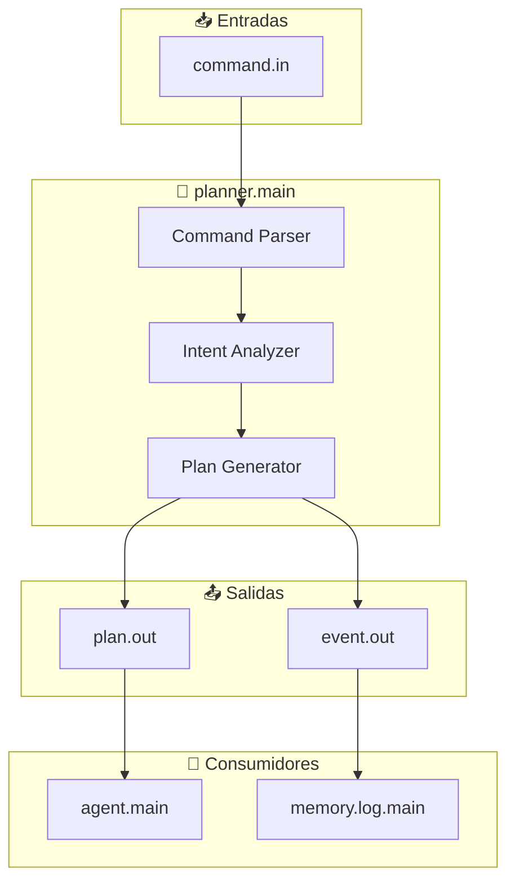

# Planner Module - Documentación

## 📋 Planificador de Comandos

<p align="center">
  <b>Módulo core que transforma comandos de usuario en planes ejecutables de uno o múltiples pasos</b>
</p>

---

## 📋 Índice

1. [Visión General](#visión-general)
2. [Arquitectura](#arquitectura)
3. [Flujo de Planificación](#flujo-de-planificación)
4. [Tipos de Planes](#tipos-de-planes)
5. [API y Puertos](#api-y-puertos)
6. [Formato de Planes](#formato-de-planes)
7. [Resolución de Intenciones](#resolución-de-intenciones)
8. [Configuración](#configuración)
9. [Ejemplos](#ejemplos)
10. [Troubleshooting](#troubleshooting)

---

## Visión General

`planner.main` es el **traductor de intenciones**. Recibe comandos de usuario en lenguaje natural desde las interfaces (CLI, Telegram), los analiza, y genera planes estructurados que describen los pasos necesarios para cumplir la solicitud.

### Responsabilidades

- 📝 **Recepción de Comandos**: Escucha `command.in` desde interfaces
- 🧠 **Análisis Semántico**: Interpreta la intención del usuario
- 📋 **Generación de Planes**: Crea planes de 1 o N pasos
- 📤 **Emisión de Planes**: Envía planes al agent para enriquecimiento

### Posición en la Arquitectura

```
┌─────────────────────────────────────────────────────────────────┐
│                    FLUJO DE PLANIFICACIÓN                        │
├─────────────────────────────────────────────────────────────────┤
│                                                                  │
│   USUARIO: "buscar mi archivo de notas y abrirlo en writer"     │
│                              │                                   │
│                              ▼                                   │
│   ┌──────────────────────────────────────────────┐              │
│   │  📥 interface.main / interface.telegram      │              │
│   │        command.out                         │              │
│   └──────────────┬───────────────────────────────┘              │
│                  │                                               │
│                  ▼ command.in                                  │
│   ┌──────────────────────────────────────────────┐              │
│   │  🧠 PLANNER.MAIN (Este módulo)                │              │
│   │  ┌─────────────┐   ┌──────────────┐          │              │
│   │  │   Parse     │──▶│   Analyze    │          │              │
│   │  └─────────────┘   └──────┬───────┘          │              │
│   │                          │                   │              │
│   │           ┌──────────────┼──────────────┐   │              │
│   │           ▼              ▼              ▼   │              │
│   │     ┌─────────┐   ┌──────────┐   ┌─────────┐ │              │
│   │     │single   │   │multi    │   │          │ │              │
│   │     │step     │   │step     │   │  (otros  │ │              │
│   │     └────┬────┘   └────┬─────┘   └────┬────┘ │              │
│   │          └──────────────┴──────────────┘   │              │
│   │                         │                    │              │
│   │                         ▼                    │              │
│   │                  plan.out ─────▶ agent.main  │              │
│   └──────────────────────────────────────────────┘              │
│                                                                  │
└─────────────────────────────────────────────────────────────────┘
```

---

## Arquitectura

### Diagrama de Conexiones



### Tabla de Conexiones

| Puerto | Dirección | Origen/Destino | Descripción |
|--------|-----------|----------------|-------------|
| `command.in` | Entrada | `interface.main`, `interface.telegram` | Comandos de usuario en texto |
| `plan.out` | Salida | `agent.main:plan.in` | **ÚNICA salida** - planes generados |
| `event.out` | Salida | `memory.log.main` | Eventos de parsing/planificación |

> **⚠️ NOTA**: El planner actual es un **traductor de intenciones simple**. No maneja contexto conversacional complejo ni emite actualizaciones de memoria. Eso es responsabilidad del agent.

---

## Flujo de Planificación

### Proceso de Generación de Plan

```
1. RECEPCIÓN DE COMANDO
   command.in: "abrir firefox y buscar tutorial de python"
           │
           ▼
2. PARSEO Y NORMALIZACIÓN
   - Lowercase
   - Remove acentos
   - Tokenizar
           │
           ▼
3. ANÁLISIS DE INTENCIÓN
   - Detectar múltiples acciones
   - Identificar entidades (firefox, tutorial python)
   - Determinar tipo de plan necesario
           │
           ▼
4. GENERACIÓN DE PASOS
   Paso 1: open_application("firefox")
   Paso 2: search("tutorial de python")
           │
           ▼
5. CONSTRUCCIÓN DEL PLAN
   {
     "plan_id": "plan_123",
     "kind": "multi_step",
     "steps": [...]
   }
           │
           ▼
6. EMISIÓN
   plan.out → agent.main
```

---

## Tipos de Planes

El planner actual soporta **dos tipos de planes**:

| Tipo | Descripción | Ejemplo de Comando |
|------|-------------|-------------------|
| `single_step` | Una sola acción | "abrir firefox" |
| `multi_step` | Secuencia de acciones | "abrir chrome y navegar a github" |

> **⚠️ NOTA**: El planner NO soporta flujos condicionales (`if/then`), bucles, o lógica compleja. Esos son manejados por el Phase Engine o el Router.

### 1. Single Step (Acción Simple)

Comandos que requieren una sola acción:

```json
{
  "plan_id": "plan_001",
  "kind": "single_step",
  "original_command": "abrir calculadora",
  "steps": [
    {
      "action": "open_application",
      "params": {"name": "calculator"},
      "step_id": "step_1"
    }
  ],
  "confidence": 0.98
}
```

**Ejemplos de comandos single-step:**
- "abrir firefox"
- "buscar archivo.pdf"
- "mostrar hora"

### 2. Multi Step (Secuencia de Acciones)

Comandos que requieren múltiples pasos secuenciales:

```json
{
  "plan_id": "plan_002",
  "kind": "multi_step",
  "original_command": "abrir writer y escribir una carta",
  "steps": [
    {
      "action": "open_application",
      "params": {"name": "writer"},
      "step_id": "step_1",
      "depends_on": null
    },
    {
      "action": "office.writer.generate",
      "params": {"prompt": "escribir una carta"},
      "step_id": "step_2",
      "depends_on": "step_1"
    }
  ],
  "confidence": 0.92
}
```

**Ejemplos de comandos multi-step:**
- "abrir chrome y navegar a github"
- "buscar archivo de notas y abrirlo"
- "abrir terminal y ejecutar ls -la"

---

## API y Puertos

### Entrada: `command.in`

**Schema**:
```json
{
  "command_id": "cmd_1234567890",
  "text": "abrir firefox y buscar tutoriales",
  "source": "cli|telegram",
  "chat_id": 123456789,
  "user_id": "user123",
  "timestamp": "2026-01-01T00:00:00Z",
  "context": {
    "previous_commands": [...],
    "session_id": "session_abc"
  }
}
```

### Salida: `plan.out`

**Schema**:
```json
{
  "plan_id": "plan_1234567890",
  "kind": "single_step|multi_step",
  "original_command": "abrir firefox y buscar tutoriales",
  "steps": [
    {
      "action": "open_application|search|...",
      "params": {},
      "step_id": "step_1",
      "depends_on": null,
      "condition": null
    }
  ],
  "confidence": 0.95,
  "estimated_duration_ms": 5000,
  "requires_approval": false,
  "trace_id": "abc-123-trace",
  "meta": {
    "source": "cli",
    "chat_id": 123456789,
    "timestamp": "2026-01-01T00:00:00Z",
    "planner_version": "1.0.0"
  }
}
```

---

## Formato de Planes

### Estructura Completa

```json
{
  "module": "planner.main",
  "port": "plan.out",
  "trace_id": "cmd_123_trace",
  "meta": {
    "source": "telegram",
    "chat_id": 1781005414,
    "timestamp": "2026-04-12T20:30:00Z"
  },
  "payload": {
    "plan_id": "plan_123",
    "kind": "multi_step",
    "original_command": "abrir writer y escribir una carta",
    "steps": [
      {
        "action": "open_application",
        "params": {
          "name": "writer",
          "command": "libreoffice --writer"
        },
        "step_id": "step_1",
        "depends_on": null,
        "estimated_duration_ms": 3000
      },
      {
        "action": "office.writer.generate",
        "params": {
          "prompt": "escribir una carta de presentación profesional"
        },
        "step_id": "step_2",
        "depends_on": "step_1",
        "estimated_duration_ms": 15000
      }
    ],
    "confidence": 0.94,
    "total_estimated_duration_ms": 18000,
    "requires_approval": true,
    "approval_reason": "Acción multi-paso con IA"
  }
}
```

### Campos Importantes

| Campo | Tipo | Descripción |
|-------|------|-------------|
| `plan_id` | string | ID único del plan |
| `kind` | enum | `single_step`, `multi_step` |
| `steps` | array | Lista de pasos a ejecutar |
| `confidence` | float | 0.0 - 1.0, confianza en el parsing |
| `requires_approval` | boolean | Si necesita confirmación del usuario |
| `estimated_duration_ms` | int | Tiempo estimado de ejecución |

---

## Resolución de Intenciones

### Mapa de Intenciones a Acciones

| Patrón de Comando | Intención Detectada | Tipo de Plan | Acción(es) |
|-------------------|---------------------|--------------|------------|
| "abrir [app]" | `open_application` | single_step | `open_application` |
| "buscar [archivo]" | `search_file` | single_step | `search_file` |
| "navegar a [url]" | `open_url` | single_step | `open_url` |
| "ejecutar [comando]" | `terminal_command` | single_step | `terminal.write_command` |
| "abrir [app] y [acción]" | `sequence` | multi_step | `open_application` + acción |
| "buscar [X] y abrir [Y]" | `search_then_open` | multi_step | `search_file` + `open_file` |
| "abrir writer y escribir [texto]" | `office_compose` | multi_step | `open_application` + `office.writer.generate` |

### Algoritmo de Parsing

```javascript
function parseCommand(text) {
  // 1. Normalización
  const normalized = text
    .toLowerCase()
    .normalize('NFD')
    .replace(/[\u0300-\u036f]/g, '');
  
  // 2. Detección de múltiples acciones (conectores)
  const hasMultipleActions = /\b(y|luego|después|then|and)\b/.test(normalized);
  
  // 3. Extracción de entidades
  const appMatch = normalized.match(/abrir\s+(\w+)/);
  const searchMatch = normalized.match(/buscar\s+(.+)/);
  
  // 4. Determinar tipo de plan
  if (hasMultipleActions) {
    return generateMultiStepPlan(normalized);
  }
  return generateSingleStepPlan(normalized);
}
```

---

## Configuración

### Manifest (`modules/planner/manifest.json`)

```json
{
  "id": "planner.main",
  "name": "Planificador de Comandos",
  "version": "1.0.0",
  "description": "Transforma comandos de usuario en planes ejecutables",
  "tier": "core",
  "priority": "high",
  "restart_policy": "immediate",
  "language": "node",
  "entry": "main.js",
  "inputs": [
    "command.in"
  ],
  "outputs": [
    "plan.out",
    "event.out"
  ],
  "config": {
    "confidence_threshold": 0.7,
    "max_steps_per_plan": 10,
    "default_timeout_ms": 30000,
    "learning_enabled": true
  }
}
```

### Configuración de Intenciones

```json
{
  "intents": {
    "open_application": {
      "patterns": ["abrir {app}", "abre {app}", "lanzar {app}"],
      "entities": ["app"],
      "action": "open_application"
    },
    "search_file": {
      "patterns": ["buscar {filename}", "encontrar {filename}", "dónde está {filename}"],
      "entities": ["filename"],
      "action": "search_file"
    },
    "sequence": {
      "patterns": ["{action1} y {action2}", "{action1} luego {action2}"],
      "connectors": ["y", "luego", "después", "then"],
      "type": "multi_step"
    }
  }
}
```

---

## Ejemplos

### Ejemplo 1: Comando Simple

**Entrada**:
```json
{
  "text": "abrir firefox",
  "source": "cli"
}
```

**Salida**:
```json
{
  "plan_id": "plan_001",
  "kind": "single_step",
  "steps": [{
    "action": "open_application",
    "params": {"name": "firefox"}
  }],
  "confidence": 0.98
}
```

### Ejemplo 2: Comando Compuesto

**Entrada**:
```json
{
  "text": "abrir chrome y navegar a github",
  "source": "telegram"
}
```

**Salida**:
```json
{
  "plan_id": "plan_002",
  "kind": "multi_step",
  "steps": [
    {
      "action": "open_application",
      "params": {"name": "chrome"},
      "step_id": "step_1"
    },
    {
      "action": "open_url",
      "params": {"url": "https://github.com"},
      "step_id": "step_2",
      "depends_on": "step_1"
    }
  ],
  "confidence": 0.95
}
```

### Ejemplo 3: Comando con Contexto

**Entrada**:
```json
{
  "text": "buscar ese archivo que mencioné antes",
  "source": "telegram",
  "context": {
    "previous_commands": [
      {"text": "necesito editar el archivo de notas", "time": "2 min ago"}
    ]
  }
}
```

**Salida**:
```json
{
  "plan_id": "plan_003",
  "kind": "single_step",
  "steps": [{
    "action": "search_file",
    "params": {"pattern": "*notas*", "type": "recent"}
  }],
  "confidence": 0.82,
  "context_used": true
}
```

---

## Troubleshooting

### Problemas Comunes

| Problema | Causa | Solución |
|----------|-------|----------|
| "No se pudo parsear comando" | Comando muy ambiguo o complejo | Agregar más ejemplos de entrenamiento |
| "Confidence bajo" | Entidades no reconocidas | Mejorar extracción de entidades |
| "Plan muy grande" | Comando con demasiadas acciones | Dividir en múltiples comandos |
| "Ciclo de dependencias" | Error en `depends_on` | Verificar grafo de dependencias |

### Debug

```javascript
// Habilitar logging de parsing
emit("event.out", {
  "level": "debug",
  "type": "planner_parsing",
  "original_text": text,
  "normalized": normalized,
  "detected_intent": intent,
  "confidence": confidence,
  "entities": entities
});
```

---

## Referencias

- **[AGENT.md](AGENT.md)** - Módulo de intérprete de intenciones
- **[ROUTER.md](ROUTER.md)** - Enrutador de acciones
- **[ARCHITECTURE.md](ARCHITECTURE.md)** - Arquitectura general
- **[AI_CAPABILITIES.md](AI_CAPABILITIES.md)** - IA para análisis semántico

---

<p align="center">
  <b>Planner Module v1.0.0</b><br>
  <sub>Planificador de comandos - Core del sistema</sub>
</p>
