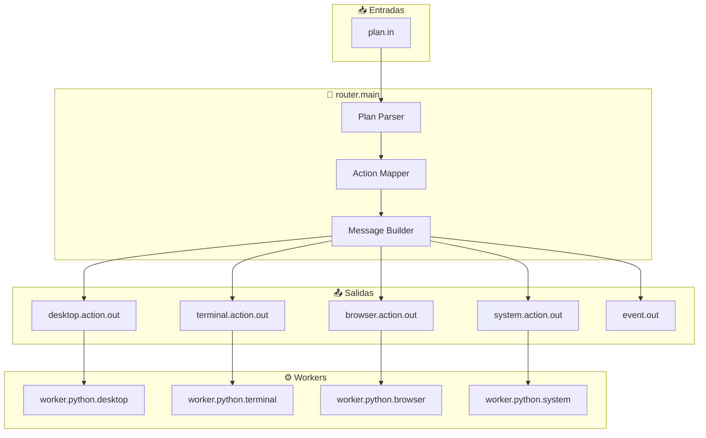

# Router Module - Documentación

## 🔄 Enrutador Central de Acciones

<p align="center">
  <b>Módulo core que enruta acciones desde planes aprobadas hacia los workers especializados</b>
</p>

---

## 📋 Índice

1. [Visión General](#visión-general)
2. [Arquitectura](#arquitectura)
3. [Flujo de Trabajo](#flujo-de-trabajo)
4. [API y Puertos](#api-y-puertos)
5. [Mapeo de Acciones](#mapeo-de-acciones)
6. [Formato de Mensajes](#formato-de-mensajes)
7. [Configuración](#configuración)
8. [Ejemplos](#ejemplos)
9. [Troubleshooting](#troubleshooting)

---

## Visión General

`router.main` es el **despachador central** del sistema. Recibe planes aprobados desde `safety.guard.main` o `approval.main`, determina qué worker puede ejecutar cada acción, y enruta los comandos al destino correcto.

### Responsabilidades

- 🎯 **Recepción de Planes**: Escucha `plan.in` desde módulos de aprobación
- 🗺️ **Enrutamiento Inteligente**: Mapea acciones a workers especializados
- 📝 **Construcción de Mensajes**: Formatea mensajes para workers según contrato
- 🔄 **Broadcast de Estado**: Emite eventos de enrutamiento para observadores

### Posición en la Arquitectura

```
┌─────────────────────────────────────────────────────────────────┐
│                    FLUJO DE EJECUCIÓN                           │
├─────────────────────────────────────────────────────────────────┤
│                                                                  │
│   planner.main → agent.main → safety.guard.main                 │
│                                      │                           │
│                                      ▼                           │
│   ┌──────────────────────────────────────────────┐              │
│   │         📍 ROUTER.MAIN (Este módulo)         │              │
│   │  ┌─────────────┐      ┌─────────────────┐  │              │
│   │  │ plan.in     │─────▶│ Route & Dispatch│  │              │
│   │  └─────────────┘      └────────┬────────┘  │              │
│   │                                │            │              │
│   │     ┌──────────┬──────────┬────┴───┐       │              │
│   │     ▼          ▼          ▼        ▼       │              │
│   │  desktop   terminal   browser   system    │              │
│   │  .action   .action   .action   .action    │              │
│   │   .out       .out       .out      .out     │              │
│   └──────┬──────────┬──────────┬────────┬──────┘              │
│          │          │          │        │                     │
│          ▼          ▼          ▼        ▼                     │
│   ┌──────────────────────────────────────────┐              │
│   │         WORKERS ESPECIALIZADOS             │              │
│   │  worker.python.desktop (apps, ventanas)  │              │
│   │  worker.python.terminal (shell commands) │              │
│   │  worker.python.browser (web automation)   │              │
│   │  worker.python.system (files, búsquedas) │              │
│   └──────────────────────────────────────────┘              │
│                                                                  │
└─────────────────────────────────────────────────────────────────┘
```

---

## Arquitectura

### Diagrama de Conexiones



### Tabla de Conexiones

| Puerto | Dirección | Origen/Destino | Descripción |
|--------|-----------|----------------|-------------|
| `plan.in` | Entrada | `safety.guard.main`, `approval.main` | Planes aprobados listos para ejecutar |
| `desktop.action.out` | Salida | `worker.python.desktop` | Acciones de aplicaciones y ventanas |
| `terminal.action.out` | Salida | `worker.python.terminal` | Comandos de terminal |
| `browser.action.out` | Salida | `worker.python.browser` | Acciones de navegador web |
| `system.action.out` | Salida | `worker.python.system` | Búsquedas y operaciones sistema |
| `event.out` | Salida | `memory.log.main`, `ui.state.main` | Eventos de enrutamiento |

---

## Flujo de Trabajo

### Proceso de Enrutamiento

```
1. RECEPCIÓN DE PLAN
   {
     "plan_id": "plan_123",
     "steps": [
       {
         "action": "open_application",
         "params": {"name": "firefox"}
       }
     ]
   }
           │
           ▼
2. PARSEO DE ACCIÓN
   action = "open_application"
   params = {"name": "firefox"}
           │
           ▼
3. MAPEO A WORKER
   "open_application" → worker.python.desktop
           │
           ▼
4. CONSTRUCCIÓN DE MENSAJE
   {
     "task_id": "task_456",
     "action": "open_application",
     "params": {"name": "firefox"},
     "trace_id": "abc-123",
     "meta": {...}
   }
           │
           ▼
5. EMISIÓN AL WORKER
   desktop.action.out → worker.python.desktop
```

---

## API y Puertos

### Entrada: `plan.in`

**Schema**:
```json
{
  "plan_id": "plan_1234567890",
  "kind": "single_step|multi_step",
  "original_command": "abrir firefox",
  "steps": [
    {
      "action": "open_application|search_file|open_url|...",
      "params": {
        "name": "firefox",
        "url": "https://example.com",
        "pattern": "*.pdf"
      },
      "step_id": "step_1"
    }
  ],
  "meta": {
    "source": "cli|telegram",
    "chat_id": 123456789,
    "timestamp": "2026-01-01T00:00:00Z",
    "plan_confidence": 0.95
  }
}
```

### Salida: `desktop.action.out`

**Schema**:
```json
{
  "task_id": "task_1234567890",
  "action": "open_application|focus_window|echo_text",
  "params": {
    "name": "firefox",
    "command": "ls -la",
    "text": "Hola mundo",
    "visible": true,
    "execute": true
  },
  "trace_id": "abc-123-trace",
  "meta": {
    "source": "cli",
    "plan_id": "plan_123",
    "step_id": "step_1",
    "timestamp": "2026-01-01T00:00:00Z"
  }
}
```

### Salida: `terminal.action.out`

**Schema**:
```json
{
  "task_id": "task_1234567890",
  "action": "terminal.write_command|terminal.show_command",
  "params": {
    "command": "npm install",
    "visible": true,
    "execute": true
  },
  "trace_id": "abc-123-trace",
  "meta": {...}
}
```

### Salida: `browser.action.out`

**Schema**:
```json
{
  "task_id": "task_1234567890",
  "action": "open_url|search|fill_form",
  "params": {
    "url": "https://github.com",
    "query": "python tutorials",
    "selector": "#search"
  },
  "trace_id": "abc-123-trace",
  "meta": {...}
}
```

### Salida: `system.action.out`

**Schema**:
```json
{
  "task_id": "task_1234567890",
  "action": "search_file|monitor_resources|get_info",
  "params": {
    "pattern": "*.py",
    "directory": "/home/user",
    "resource": "cpu"
  },
  "trace_id": "abc-123-trace",
  "meta": {...}
}
```

---

## Mapeo de Acciones

### Tabla de Enrutamiento

| Acción | Worker Destino | Puerto de Salida | Descripción |
|--------|---------------|------------------|-------------|
| `open_application` | `worker.python.desktop` | `desktop.action.out` | Abrir aplicaciones |
| `terminal.write_command` | `worker.python.terminal` | `terminal.action.out` | Escribir y ejecutar en terminal |
| `terminal.show_command` | `worker.python.terminal` | `terminal.action.out` | Mostrar comando sin ejecutar |
| `open_url` | `worker.python.browser` | `browser.action.out` | Navegar a URL |
| `search` | `worker.python.browser` | `browser.action.out` | Buscar en web |
| `search_file` | `worker.python.system` | `system.action.out` | Buscar archivos |
| `monitor_resources` | `worker.python.system` | `system.action.out` | Monitorear CPU/memoria |
| `echo_text` | `worker.python.desktop` | `desktop.action.out` | Retornar texto simple |

### Lógica de Enrutamiento

```javascript
function routeAction(action, params) {
  switch (action) {
    case 'open_application':
    case 'focus_window':
    case 'echo_text':
      return { port: 'desktop.action.out', worker: 'worker.python.desktop' };
    
    case 'terminal.write_command':
    case 'terminal.show_command':
      return { port: 'terminal.action.out', worker: 'worker.python.terminal' };
    
    case 'open_url':
    case 'search':
    case 'fill_form':
      return { port: 'browser.action.out', worker: 'worker.python.browser' };
    
    case 'search_file':
    case 'monitor_resources':
    case 'get_info':
      return { port: 'system.action.out', worker: 'worker.python.system' };
    
    default:
      throw new Error(`Acción no soportada: ${action}`);
  }
}
```

---

## Formato de Mensajes

### Mensaje Completo Ejemplo

```json
{
  "module": "router.main",
  "port": "desktop.action.out",
  "trace_id": "plan_123_abc_trace",
  "meta": {
    "source": "telegram",
    "chat_id": 1781005414,
    "timestamp": "2026-04-12T20:30:00Z",
    "plan_id": "plan_123",
    "step_id": "step_1"
  },
  "payload": {
    "task_id": "task_456",
    "action": "open_application",
    "params": {
      "name": "firefox",
      "command": "firefox"
    }
  }
}
```

---

## Configuración

### Manifest (`modules/router/manifest.json`)

```json
{
  "id": "router.main",
  "name": "Router Central",
  "version": "1.0.0",
  "description": "Enruta acciones desde planes a workers especializados",
  "tier": "core",
  "priority": "critical",
  "restart_policy": "immediate",
  "language": "node",
  "entry": "main.js",
  "inputs": [
    "plan.in",
    "config.in"
  ],
  "outputs": [
    "desktop.action.out",
    "terminal.action.out",
    "browser.action.out",
    "system.action.out",
    "event.out",
    "error.out"
  ],
  "config": {
    "routing_table": "config/routing.json",
    "timeout_ms": 30000,
    "max_retries": 3
  }
}
```

### Propagación Obligatoria de Metadata

El router **debe propagar** estos campos de metadata en cada mensaje que construye:

| Campo | Origen | Destino | Descripción |
|-------|--------|---------|-------------|
| `trace_id` | `message.trace_id` | `message.trace_id` | Rastreo completo de la tarea |
| `meta.plan_id` | `plan.plan_id` | `action.meta.plan_id` | ID del plan que generó la acción |
| `meta.step_id` | `plan.steps[N].step_id` | `action.meta.step_id` | ID del paso específico |
| `meta.action` | `plan.steps[N].action` | `action.meta.action` | Acción que se ejecutará |
| `meta.worker` | routing_table mapping | `action.meta.worker` | Worker destino calculado |
| `meta.timestamp` | generado por router | `action.meta.timestamp` | Timestamp de enrutamiento |

> **⚠️ IMPORTANTE**:
> - `trace_id` se propaga **a nivel superior**, no dentro de `meta`.
> - `plan_id`, `step_id`, `action`, `worker` y `timestamp` viajan dentro de `meta`.
> - El router es donde se consolida la trazabilidad del mensaje hacia los workers.

### Configuración de Enrutamiento

```json
{
  "routing_table": {
    "desktop": {
      "actions": ["open_application", "focus_window", "echo_text"],
      "worker": "worker.python.desktop",
      "port": "desktop.action.out"
    },
    "terminal": {
      "actions": ["terminal.write_command", "terminal.show_command"],
      "worker": "worker.python.terminal",
      "port": "terminal.action.out"
    },
    "browser": {
      "actions": ["open_url", "search", "fill_form"],
      "worker": "worker.python.browser",
      "port": "browser.action.out"
    },
    "system": {
      "actions": ["search_file", "monitor_resources", "get_info"],
      "worker": "worker.python.system",
      "port": "system.action.out"
    }
  }
}
```

---

## Ejemplos

### Ejemplo 1: Abrir Aplicación

**Entrada** (`plan.in`):
```json
{
  "plan_id": "plan_001",
  "steps": [{
    "action": "open_application",
    "params": {"name": "firefox"}
  }]
}
```

**Salida** (`desktop.action.out`):
```json
{
  "task_id": "task_001",
  "action": "open_application",
  "params": {"name": "firefox", "command": "firefox"}
}
```

### Ejemplo 2: Comando de Terminal

**Entrada** (`plan.in`):
```json
{
  "plan_id": "plan_002",
  "steps": [{
    "action": "terminal.write_command",
    "params": {"command": "ls -la", "execute": true}
  }]
}
```

**Salida** (`terminal.action.out`):
```json
{
  "task_id": "task_002",
  "action": "terminal.write_command",
  "params": {"command": "ls -la", "visible": true, "execute": true}
}
```

### Ejemplo 3: Navegar Web

**Entrada** (`plan.in`):
```json
{
  "plan_id": "plan_003",
  "steps": [{
    "action": "open_url",
    "params": {"url": "https://github.com"}
  }]
}
```

**Salida** (`browser.action.out`):
```json
{
  "task_id": "task_003",
  "action": "open_url",
  "params": {"url": "https://github.com"}
}
```

---

## Troubleshooting

### Problemas Comunes

| Problema | Causa | Solución |
|----------|-------|----------|
| "Acción no soportada" | La acción no está en la tabla de enrutamiento | Agregar acción a `config/routing.json` |
| "Worker no disponible" | El worker destino no está corriendo | Verificar estado del worker con `health_check.py` |
| "Timeout en enrutamiento" | El plan es muy grande o complejo | Aumentar `timeout_ms` en config |
| "Params inválidos" | Faltan parámetros requeridos | Verificar schema de la acción |

### Debug

Habilitar logs detallados:

```javascript
// En router/main.js
emit("event.out", {
  "level": "debug",
  "type": "router_dispatch",
  "action": action,
  "target_worker": worker,
  "target_port": port,
  "plan_id": planId
});
```

---

## Referencias

- **[ARCHITECTURE.md](ARCHITECTURE.md)** - Arquitectura general
- **[TASK_CLOSURE_GOVERNANCE.md](TASK_CLOSURE_GOVERNANCE.md)** - Gobierno de cierre de tareas
- **[PORT_CONTRACTS.md](PORT_CONTRACTS.md)** - Contratos de puertos
- **[MODULE_CLASSIFICATION.md](MODULE_CLASSIFICATION.md)** - Clasificación Core/Satélite

---

<p align="center">
  <b>Router Module v1.0.0</b><br>
  <sub>Enrutador central de acciones - Core del sistema</sub>
</p>
