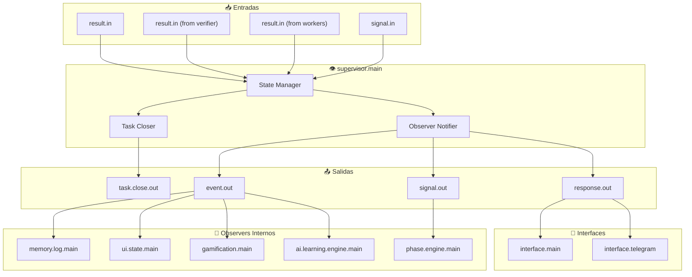

# Supervisor Module - Documentación

## 👁️ Gestor de Ciclo de Vida de Tareas

<p align="center">
  <b>Módulo core único con autoridad para cerrar tareas. Orquesta el estado de ejecución y mantiene el registro de todas las operaciones.</b>
</p>

---

## 📋 Índice

1. [Visión General](#visión-general)
2. [Rol de Cierre Único](#rol-de-cierre-único)
3. [Arquitectura](#arquitectura)
4. [Estados de Tarea](#estados-de-tarea)
5. [API y Puertos](#api-y-puertos)
6. [Flujo de Cierre](#flujo-de-cierre)
7. [Formato de Resultados](#formato-de-resultados)
8. [Configuración](#configuración)
9. [Ejemplos](#ejemplos)
10. [Troubleshooting](#troubleshooting)

---

## Visión General

`supervisor.main` es el **único closer oficial** del sistema. Recibe resultados de ejecución desde workers (directamente o vía verifier), determina el estado final de cada tarea, y emite el cierre oficial.

### Responsabilidades

- 🔒 **Cierre de Tareas**: Único módulo con autoridad para marcar tareas como completadas/erróneas
- 📊 **Gestión de Estado**: Mantiene el estado de todas las tareas en vuelo
- 📝 **Logging**: Registra el ciclo de vida completo de cada tarea
- 🔄 **Coordinación**: Trabaja con Phase Engine para transiciones de estado
- 📤 **Broadcast**: Notifica a observers sobre cambios de estado

### Autoridad del Módulo

```
┌─────────────────────────────────────────────────────────────────┐
│                    GOBIERNO DE CIERRE                           │
├─────────────────────────────────────────────────────────────────┤
│                                                                  │
│   ┌──────────────────────────────────────────────────────┐      │
│   │              🔒 SUPERVISOR.MAIN (Closer Único)       │      │
│   │                                                      │      │
│   │  ┌─────────────┐  ┌──────────────┐  ┌─────────────┐  │      │
│   │  │   result.in │  │   Decide     │  │  task.close │  │      │
│   │  │   (workers) │──▶│   Estado     │──▶│  (oficial)  │  │      │
│   │  └─────────────┘  └──────────────┘  └─────────────┘  │      │
│   │          │                                    │        │      │
│   │          │         ┌──────────────┐           │        │      │
│   │          │         │   EMITE      │           │        │      │
│   │          │         │              │           │        │      │
│   │          └────────▶│  event.out   │            │        │      │
│   │                    │  response.out│────────────┘        │      │
│   │                    └──────┬───────┘                    │      │
│   │                           │                           │      │
│   └───────────────────────────┼───────────────────────────┘      │
│                               │                                   │
│          ┌────────────────────┼────────────────────┐              │
│          ▼                    ▼                    ▼              │
│   ┌────────────┐     ┌──────────────┐     ┌──────────────┐        │
│   │ memory.log │     │   ui.state   │     │interface.*   │        │
│   │  (OBSERVER)│     │  (OBSERVER)  │     │  (INTERFAZ)  │        │
│   └────────────┘     └──────────────┘     └──────────────┘        │
│                                                                  │
│   FLUJOS:                                                        │
│   • result.in: workers/verifier → supervisor                     │
│   • event.out: observadores internos (memory, ui.state)          │
│   • response.out: mensaje final a interfaces (CLI, Telegram)       │
│   • task.close.out: cierre oficial → phase engine                  │
│                                                                  │
└─────────────────────────────────────────────────────────────────┘
```

---

## Rol de Cierre Único

### Regla #9: Un Solo Resultado Final

Según **[TASK_CLOSURE_GOVERNANCE.md](TASK_CLOSURE_GOVERNANCE.md)**:

| Rol | Módulos | Autoridad |
|-----|---------|-----------|
| **CLOSER** | `supervisor.main` | ✅ Puede cerrar tareas |
| **INFORMER** | `worker.*`, `ai.assistant.main` | ❌ Reportan resultados, no cierran |
| **VERIFIER** | `verifier.engine.main` | ❌ Verifica, pero no cierra |
| **OBSERVER** | `memory.log.main`, `ui.state.main`, `gamification.main`, `ai.learning.engine.main` | ❌ Solo observan `event.out` |
| **INTERFACE TARGET** | `interface.main`, `interface.telegram` | ❌ Reciben `response.out`, no cierran ni observan `event.out` |

### Flujos Válidos

**Flujo simple (sin verifier)**:
```
router → worker
         │
         ├── result.out ──► supervisor (cierra)
         │
         └── event.out ───► memory.log, ui.state (observan)
```

**Flujo con verifier**:
```
router → worker
         │
         ├── result.out ──► verifier ──► supervisor (cierra)
         │
         └── event.out ───► memory.log, ui.state (observan)
```

> **📌 Separación de concerns**:
> - `result.out` → solo para cierre de tareas
> - `event.out` → observadores internos (logs, estado UI interna, memoria)

---

## Arquitectura

### Diagrama de Conexiones



### Tabla de Conexiones

| Puerto | Dirección | Origen/Destino | Descripción |
|--------|-----------|----------------|-------------|
| `result.in` | Entrada | `worker.*`, `verifier.engine.main` | Resultados de ejecución |
| `signal.in` | Entrada | `phase.engine.main` | Señales de control de fase |
| `plan.in` | Entrada | `agent.main`, `planner.main` | Planes iniciados |
| `event.out` | Salida | `memory.log.main`, `ui.state.main` | Eventos para observadores internos |
| `response.out` | Salida | `interface.main`, `interface.telegram` | Mensaje final al usuario |
| `task.close.out` | Salida | `phase.engine.main` | Cierres oficiales de tareas |
| `signal.out` | Salida | `phase.engine.main` | Señales de estado |

---

## Estados de Tarea

### Diagrama de Estados

```
┌──────────┐    start     ┌──────────┐   worker_result   ┌──────────┐
│  IDLE    │────────────▶│ RUNNING  │────────────────▶│PENDING   │
└──────────┘             └──────────┘   (success/error) │VERIFICATION│
                                                       └────┬─────┘
                                                            │
                    ┌───────────────────────────────────────┘
                    │
                    ▼ verifier_result / direct
┌──────────┐   close_success  ┌──────────┐
│COMPLETED │◀──────────────────│ CLOSING  │
└──────────┘                   └──────────┘
                                      │
                    close_error       │
                    ┌─────────────────┘
                    ▼
┌──────────┐
│  ERROR   │
└──────────┘

Estados intermedios:
- awaiting_approval
- approved
- executing
- verifying
```

### Estados Detallados

| Estado | Descripción | Transición |
|--------|-------------|------------|
| `idle` | Sin tarea activa | → `running` (al recibir plan) |
| `running` | Ejecutando | → `pending_verification` o `closing` |
| `pending_verification` | Esperando verifier | → `closing` |
| `closing` | Procesando cierre | → `completed` o `error` |
| `completed` | Tarea exitosa | → `idle` |
| `error` | Tarea fallida | → `idle` |
| `timeout` | Timeout alcanzado | → `error` |
| `cancelled` | Cancelado por usuario | → `error` |

---

## API y Puertos

### Entrada: `result.in` (desde Workers)

**Schema**:
```json
{
  "task_id": "task_1234567890",
  "status": "success|error|partial",
  "result": {
    "opened": true,
    "application": "firefox",
    "window_id": "0x04200001"
  },
  "_verification": {
    "level": "window_confirmed",
    "confidence": 0.95
  },
  "trace_id": "abc-123-trace",
  "meta": {
    "worker": "worker.python.desktop",
    "timestamp": "2026-01-01T00:00:00Z"
  }
}
```

### Entrada: `result.in` (desde Verifier)

**Schema**:
```json
{
  "task_id": "task_1234567890",
  "status": "success_verified",
  "result": {
    "original_result": {...},
    "verification": {
      "level": "window_confirmed",
      "confidence": 0.95,
      "executive_state": "success_verified"
    }
  },
  "trace_id": "abc-123-trace",
  "meta": {
    "verifier": "verifier.engine.main"
  }
}
```

### Salida: `event.out` (Task Closed - Observadores internos)

**Schema**:
```json
{
  "type": "task_closed",
  "task_id": "task_1234567890",
  "status": "completed|error|timeout|cancelled",
  "result_summary": {
    "success": true,
    "confidence": 0.95,
    "verification_level": "window_confirmed"
  },
  "timestamp": "2026-01-01T00:00:00Z",
  "trace_id": "abc-123-trace",
  "meta": {
    "source": "supervisor.main",
    "duration_ms": 3500
  }
}
```

### Salida: `response.out` (Mensaje al usuario)

**Schema**:
```json
{
  "module": "supervisor.main",
  "port": "response.out",
  "trace_id": "task_123_trace",
  "meta": {
    "source": "supervisor.main",
    "destination": "interface.telegram",
    "timestamp": "2026-01-01T00:00:05Z"
  },
  "payload": {
    "task_id": "task_123",
    "user_message": "✅ Firefox abierto y verificado",
    "type": "success",
    "chat_id": 123456789,
    "result_summary": {
      "success": true,
      "confidence": 0.95
    }
  }
}
```

> **📌 Separación de salidas**:
> - `event.out`: Para observadores **internos** (memory.log, ui.state, gamification)
> - `response.out`: Para **interfaces** (interface.main, interface.telegram)

### Tipos de Eventos Emitidos

| Tipo | Descripción | Cuándo se emite |
|------|-------------|-----------------|
| `task_started` | Tarea iniciada | Al recibir plan nuevo |
| `task_running` | Tarea en ejecución | Al enviar a workers |
| `supervisor_task_verified` | Verificación exitosa | confidence >= 0.90 |
| `supervisor_task_high_confidence` | Alta confianza | 0.75 - 0.89 |
| `supervisor_task_partial` | Resultado parcial | 0.50 - 0.74 |
| `supervisor_task_weak` | Baja confianza | 0.25 - 0.49 |
| `supervisor_task_unverified` | Sin verificación | < 0.25 |
| `task_closed` | Tarea cerrada | Cierre final |
| `task_error` | Error en tarea | Fallo de ejecución |
| `task_timeout` | Timeout | Tiempo excedido |

---

## Flujo de Cierre

### Proceso Completo

```
1. RECEPCIÓN DE RESULTADO
   result.in: {
     "task_id": "task_123",
     "status": "success",
     "_verification": {"confidence": 0.95}
   }
           │
           ▼
2. VALIDACIÓN
   - task_id existe en registro?
   - Verificar timeout no excedido
   - Validar schema del resultado
           │
           ▼
3. DETERMINACIÓN DE ESTADO
   IF _verification.confidence >= 0.90:
      status = "success_verified"
   ELIF _verification.confidence >= 0.75:
      status = "high_confidence"
   ELIF result.status == "error":
      status = "error"
   ELSE:
      status = result.status
           │
           ▼
4. CIERRE OFICIAL
   - Actualizar registro de tarea
   - Marcar como closed
   - Calcular duración
           │
           ▼
5. EMISIÓN DE EVENTOS
   event.out: {
     "type": "task_closed",
     "status": "completed",
     ...
   }
           │
           ▼
6. NOTIFICACIÓN DE RESULTADOS

   A. response.out → INTERFACES (mensaje al usuario)
      - interface.main (CLI)
      - interface.telegram (Telegram)

   B. event.out → OBSERVERS INTERNOS
      - memory.log.main (persistencia)
      - ui.state.main (actualización UI interna)
      - gamification.main (XP si éxito)
      - ai.learning.engine.main (aprendizaje)

   C. signal.out / task.close.out → PHASE ENGINE
      - phase.engine.main (transición de fase y cierre oficial)
```

---

## Formato de Resultados

### Resultado Exitoso Verificado

```json
{
  "module": "supervisor.main",
  "port": "event.out",
  "trace_id": "task_123_trace",
  "meta": {
    "source": "internal",
    "timestamp": "2026-04-12T20:30:00Z"
  },
  "payload": {
    "type": "supervisor_task_verified",
    "task_id": "task_123",
    "status": "success_verified",
    "confidence": 0.95,
    "verification_level": "window_confirmed",
    "user_message": "✅ Firefox abierto y verificado",
    "evidence_summary": "Ventana detectada y enfocada",
    "duration_ms": 3200,
    "result": {
      "application": "firefox",
      "window_id": "0x04200001",
      "process_id": 12345
    }
  }
}
```

### Resultado con Error

```json
{
  "payload": {
    "type": "task_error",
    "task_id": "task_456",
    "status": "error",
    "error_code": "WORKER_TIMEOUT",
    "user_message": "❌ Timeout al abrir aplicación",
    "error_details": {
      "worker": "worker.python.desktop",
      "action": "open_application",
      "timeout_ms": 30000,
      "elapsed_ms": 30150
    }
  }
}
```

---

## Configuración

### Manifest (`modules/supervisor/manifest.json`)

```json
{
  "id": "supervisor.main",
  "name": "Supervisor de Tareas",
  "version": "1.0.0",
  "description": "Gestor de ciclo de vida de tareas - Único closer oficial",
  "tier": "core",
  "priority": "critical",
  "restart_policy": "immediate",
  "language": "node",
  "entry": "main.js",
  "inputs": [
    "result.in",
    "plan.in",
    "signal.in",
    "config.in"
  ],
  "outputs": [
    "event.out",
    "response.out",
    "task.close.out",
    "signal.out",
    "state.out"
  ],
  "config": {
    "default_timeout_ms": 30000,
    "max_concurrent_tasks": 10,
    "cleanup_completed_after_ms": 3600000,
    "confidence_thresholds": {
      "verified": 0.90,
      "high": 0.75,
      "partial": 0.50,
      "weak": 0.25
    }
  }
}
```

### Umbral de Confianza

```javascript
const CONFIDENCE_THRESHOLDS = {
  VERIFIED: 0.90,      // supervisor_task_verified
  HIGH: 0.75,          // supervisor_task_high_confidence
  PARTIAL: 0.50,       // supervisor_task_partial
  WEAK: 0.25,          // supervisor_task_weak
  UNVERIFIED: 0.00     // supervisor_task_unverified
};
```

---

## Ejemplos

### Ejemplo 1: Cierre Exitoso

**Entrada** (`result.in` desde verifier):
```json
{
  "task_id": "task_001",
  "status": "success",
  "_verification": {
    "confidence": 0.95,
    "level": "window_confirmed"
  }
}
```

**Salida** (`event.out`):
```json
{
  "type": "supervisor_task_verified",
  "task_id": "task_001",
  "status": "success_verified",
  "confidence": 0.95,
  "user_message": "✅ Aplicación abierta y verificada"
}
```

### Ejemplo 2: Cierre con Error

**Entrada** (`result.in` desde worker):
```json
{
  "task_id": "task_002",
  "status": "error",
  "error": "Application not found"
}
```

**Salida** (`event.out`):
```json
{
  "type": "task_error",
  "task_id": "task_002",
  "status": "error",
  "error_code": "APP_NOT_FOUND",
  "user_message": "❌ No se encontró la aplicación"
}
```

### Ejemplo 3: Timeout

**Entrada**: Tarea `task_003` excede 30s sin resultado

**Salida** (`event.out`):
```json
{
  "type": "task_timeout",
  "task_id": "task_003",
  "status": "timeout",
  "user_message": "⏱️ La operación tomó demasiado tiempo"
}
```

---

## Troubleshooting

### Problemas Comunes

| Problema | Causa | Solución |
|----------|-------|----------|
| "Task not found" | Llegó resultado para tarea desconocida | Verificar que todas las tareas se registran al iniciar |
| "Duplicate close" | Múltiple intento de cierre | Implementar idempotencia en cierre |
| "Timeout cascade" | Múltiples timeouts simultáneos | Ajustar límites de concurrencia |
| "Confidence missing" | Resultado sin verificación | Workers deben incluir `_verification` |

### Debug

```javascript
// Log de estados
emit("event.out", {
  "level": "debug",
  "type": "supervisor_state_change",
  "task_id": taskId,
  "from_state": oldState,
  "to_state": newState,
  "trigger": "worker_result|timeout|approval"
});
```

---

## Referencias

- **[TASK_CLOSURE_GOVERNANCE.md](TASK_CLOSURE_GOVERNANCE.md)** - Gobierno de cierre de tareas
- **[ARCHITECTURE.md](ARCHITECTURE.md)** - Arquitectura general
- **[VERIFIER.md](VERIFIER.md)** - Motor de verificación
- **[PHASE_ENGINE_DESIGN.md](PHASE_ENGINE_DESIGN.md)** - Motor de fases

---

<p align="center">
  <b>Supervisor Module v1.0.0</b><br>
  <sub>Gestor de ciclo de vida - Closer Único del sistema</sub>
</p>
