# Diagrama de Arquitectura - Blue Arrow

## Diagrama de Flujo Completo de Conexiones

```mermaid
flowchart TB
    subgraph Interfaces["🖥️ Interfaces de Entrada"]
        direction TB
        IF_MAIN["interface.main"]
        IF_TEL["interface.telegram"]
    end

    subgraph AI_Layer["🧠 Capa de IA"]
        direction TB
        AI_INTENT["ai.intent.main"]
        AI_ASST["ai.assistant.main"]
        AI_MEM["ai.memory.semantic.main"]
        AI_LEARN["ai.learning.engine.main"]
        AI_AUDIT["ai.self.audit.main"]
    end

    subgraph Planning["📋 Planificación & Control"]
        direction TB
        PLANNER["planner.main"]
        GUIDE["guide.main"]
        AGENT["agent.main"]
        SUPERVISOR["supervisor.main"]
        PHASE["phase.engine.main"]
    end

    subgraph Safety["🛡️ Seguridad & Aprobación"]
        direction TB
        SAFETY["safety.guard.main"]
        APPROVAL["approval.main"]
    end

    subgraph Routing["🔄 Enrutamiento"]
        direction TB
        ROUTER["router.main"]
    end

    subgraph Workers["⚙️ Workers de Ejecución"]
        direction TB
        WK_Desktop["worker.python.desktop"]
        WK_Terminal["worker.python.terminal"]
        WK_System["worker.python.system"]
        WK_Browser["worker.python.browser"]
    end

    subgraph Verifier["✅ Verificación"]
        direction TB
        VERIFIER["verifier.engine.main"]
    end

    subgraph Memory["💾 Memoria & Estado"]
        direction TB
        MEM_LOG["memory.log.main"]
        UI_STATE["ui.state.main"]
        APPS_SESSION["apps.session.main"]
    end

    subgraph Telegram_UI["📱 UI Telegram"]
        direction TB
        TEL_MENU["telegram.menu.main"]
        SYS_MENU["system.menu.main"]
        MEM_MENU["memory.menu.main"]
        APPS_MENU["apps.menu.main"]
        TEL_HUD["telegram.hud.main"]
    end

    subgraph Project["📊 Proyecto & Office"]
        direction TB
        PROJ_AUDIT["project.audit.main"]
        OFFICE["office.writer.main"]
    end

    subgraph Gamification["🎮 Gamificación"]
        GAMIF["gamification.main"]
    end

    %% === Interfaces → Planning ===
    IF_MAIN -->|command.out| PLANNER
    IF_TEL -->|command.out| PLANNER
    IF_MAIN -->|command.out| MEM_LOG
    IF_TEL -->|command.out| MEM_LOG
    IF_MAIN -->|command.out| AI_INTENT
    IF_TEL -->|command.out| AI_INTENT

    %% === AI Layer ===
    AI_INTENT -->|event.out| MEM_LOG
    AI_INTENT -->|analysis.out| GUIDE
    AI_ASST -->|result.out| SUPERVISOR
    AI_ASST -->|result.out| OFFICE
    AI_ASST -->|result.out| IF_TEL
    AI_ASST -->|event.out| MEM_LOG
    AI_ASST -->|event.out| IF_MAIN
    AI_ASST -->|event.out| IF_TEL
    AI_ASST -->|event.out| GUIDE
    AI_MEM -->|event.out| MEM_LOG
    AI_LEARN -->|event.out| MEM_LOG
    AI_AUDIT -->|event.out| MEM_LOG

    %% === Planning Flow ===
    PLANNER -->|command.out| GUIDE
    PLANNER -->|event.out| MEM_LOG
    PLANNER -->|plan.out| SUPERVISOR
    PLANNER -->|plan.out| SAFETY
    PLANNER -->|signal.out| PHASE

    GUIDE -->|command.out| AGENT
    GUIDE -->|response.out| IF_MAIN
    GUIDE -->|response.out| IF_TEL
    GUIDE -->|event.out| MEM_LOG
    GUIDE -->|event.out| UI_STATE

    AGENT -->|event.out| MEM_LOG
    AGENT -->|memory.query.out| MEM_LOG
    AGENT -->|plan.out| SUPERVISOR
    AGENT -->|plan.out| SAFETY
    AGENT -->|approval.command.out| APPROVAL
    AGENT -->|signal.out| PHASE
    AGENT -->|audit.request.out| PROJ_AUDIT

    PHASE -->|signal.out| PLANNER
    PHASE -->|command.out| ROUTER
    PHASE -->|state.out| UI_STATE
    PHASE -->|event.out| MEM_LOG

    %% === Safety & Approval ===
    SAFETY -->|signal.out| PHASE
    SAFETY -->|approved.plan.out| ROUTER
    SAFETY -->|blocked.plan.out| APPROVAL
    SAFETY -->|event.out| MEM_LOG
    SAFETY -->|event.out| UI_STATE

    APPROVAL -->|signal.out| PHASE
    APPROVAL -->|approved.plan.out| ROUTER
    APPROVAL -->|event.out| MEM_LOG
    APPROVAL -->|event.out| SUPERVISOR
    APPROVAL -->|event.out| UI_STATE
    APPROVAL -->|response.out| IF_MAIN
    APPROVAL -->|response.out| IF_TEL
    APPROVAL -->|rejected.result.out| SUPERVISOR
    APPROVAL -->|ui.response.out| IF_TEL

    %% === Router → Workers ===
    ROUTER -->|desktop.action.out| WK_Desktop
    ROUTER -->|terminal.action.out| WK_Terminal
    ROUTER -->|system.action.out| WK_System
    ROUTER -->|browser.action.out| WK_Browser
    ROUTER -->|ai.action.out| AI_ASST
    ROUTER -->|office.action.out| OFFICE
    ROUTER -->|native.action.out| MEM_LOG
    ROUTER -->|event.out| MEM_LOG
    ROUTER -->|event.out| SUPERVISOR
    ROUTER -->|event.out| GUIDE

    %% === Workers → Verifier ===
    WK_Desktop -->|result.out| VERIFIER
    WK_Terminal -->|result.out| VERIFIER
    WK_System -->|result.out| VERIFIER
    WK_Browser -->|result.out| VERIFIER
    WK_Desktop -->|result.out| OFFICE

    %% === Workers Events ===
    WK_Desktop -->|event.out| MEM_LOG
    WK_Terminal -->|event.out| MEM_LOG
    WK_Terminal -->|event.out| UI_STATE
    WK_Terminal -->|event.out| GUIDE
    WK_System -->|event.out| MEM_LOG
    WK_Browser -->|event.out| MEM_LOG

    %% === Verifier → Supervisor ===
    VERIFIER -->|result.out| SUPERVISOR
    VERIFIER -->|event.out| MEM_LOG
    VERIFIER -->|event.out| GUIDE
    VERIFIER -->|verification.out| MEM_LOG

    %% === Memory Outputs ===
    MEM_LOG -->|memory.out| IF_MAIN
    MEM_LOG -->|memory.out| IF_TEL

    %% === Supervisor ===
    SUPERVISOR -->|event.out| MEM_LOG
    SUPERVISOR -->|event.out| UI_STATE
    SUPERVISOR -->|event.out| GUIDE
    SUPERVISOR -->|event.out| IF_MAIN
    SUPERVISOR -->|event.out| IF_TEL
    SUPERVISOR -->|event.out| APPS_SESSION
    SUPERVISOR -->|result.out| IF_TEL

    %% === UI State ===
    UI_STATE -->|event.out| MEM_LOG
    UI_STATE -->|event.out| IF_TEL
    UI_STATE -->|ui.state.out| TEL_HUD
    UI_STATE -->|ui.render.request.out| TEL_HUD
    UI_STATE -->|event.out| GUIDE
    UI_STATE -->|callback.in| IF_TEL

    %% === Telegram Callbacks ===
    IF_TEL -->|callback.out| TEL_MENU
    IF_TEL -->|callback.out| SYS_MENU
    IF_TEL -->|callback.out| MEM_MENU
    IF_TEL -->|callback.out| APPS_MENU
    IF_TEL -->|callback.out| UI_STATE
    IF_TEL -->|callback.out| APPROVAL
    IF_TEL -->|event.out| MEM_LOG
    IF_TEL -->|event.out| GUIDE
    IF_TEL -->|action.out| MEM_LOG

    %% === Telegram Menus ===
    TEL_MENU -->|ui.response.out| IF_TEL
    TEL_MENU -->|command.out| AGENT
    TEL_MENU -->|command.out| MEM_LOG
    TEL_MENU -->|approval.request.out| APPROVAL
    TEL_MENU -->|approval.callback.out| APPROVAL

    SYS_MENU -->|ui.response.out| IF_TEL
    SYS_MENU -->|command.out| AGENT
    SYS_MENU -->|command.out| MEM_LOG

    MEM_MENU -->|ui.response.out| IF_TEL
    MEM_MENU -->|memory.query.out| MEM_LOG

    APPS_MENU -->|ui.response.out| IF_TEL
    APPS_MENU -->|command.out| AGENT
    APPS_MENU -->|command.out| MEM_LOG

    TEL_HUD -->|ui.response.out| IF_TEL

    %% === App Session ===
    APPS_SESSION -->|app.context.out| UI_STATE
    APPS_SESSION -->|event.out| MEM_LOG
    APPS_SESSION -->|event.out| IF_TEL
    APPS_SESSION -->|memory.sync.out| MEM_LOG
    APPS_SESSION -->|memory.sync.out| IF_TEL
    APPS_SESSION -->|event.out| GUIDE

    %% === Project Audit ===
    PROJ_AUDIT -->|event.out| MEM_LOG
    PROJ_AUDIT -->|response.out| IF_MAIN
    PROJ_AUDIT -->|response.out| IF_TEL

    %% === Office Writer ===
    OFFICE -->|desktop.action.out| WK_Desktop
    OFFICE -->|ai.action.out| AI_ASST
    OFFICE -->|event.out| MEM_LOG
    OFFICE -->|event.out| GUIDE
    OFFICE -->|result.out| SUPERVISOR
    OFFICE -->|ui.response.out| IF_TEL

    %% === Gamification ===
    GAMIF -->|event.out| MEM_LOG

    %% === Style Classes ===
    classDef interface fill:#e1f5ff,stroke:#01579b,stroke-width:2px
    classDef ai fill:#f3e5f5,stroke:#4a148c,stroke-width:2px
    classDef planning fill:#fff3e0,stroke:#e65100,stroke-width:2px
    classDef safety fill:#ffebee,stroke:#b71c1c,stroke-width:2px
    classDef router fill:#e8f5e9,stroke:#1b5e20,stroke-width:2px
    classDef worker fill:#e0f2f1,stroke:#004d40,stroke-width:2px
    classDef verifier fill:#e8eaf6,stroke:#283593,stroke-width:2px
    classDef memory fill:#fff8e1,stroke:#f57f17,stroke-width:2px
    classDef telegram fill:#fce4ec,stroke:#880e4f,stroke-width:2px
    classDef project fill:#f1f8e9,stroke:#33691e,stroke-width:2px
    classDef gamif fill:#e0f7fa,stroke:#006064,stroke-width:2px

    class IF_MAIN,IF_TEL interface
    class AI_INTENT,AI_ASST,AI_MEM,AI_LEARN,AI_AUDIT ai
    class PLANNER,GUIDE,AGENT,SUPERVISOR,PHASE planning
    class SAFETY,APPROVAL safety
    class ROUTER router
    class WK_Desktop,WK_Terminal,WK_System,WK_Browser worker
    class VERIFIER verifier
    class MEM_LOG,UI_STATE,APPS_SESSION memory
    class TEL_MENU,SYS_MENU,MEM_MENU,APPS_MENU,TEL_HUD telegram
    class PROJ_AUDIT,OFFICE project
    class GAMIF gamif
```

## Resumen de Módulos por Capa

| Capa | Módulos | Rol |
|------|---------|-----|
| **Interfaces** | `interface.main`, `interface.telegram` | Entrada de comandos del usuario |
| **IA** | `ai.intent`, `ai.assistant`, `ai.memory.semantic`, `ai.learning`, `ai.self.audit` | Procesamiento inteligente |
| **Planificación** | `planner`, `guide`, `agent`, `supervisor`, `phase.engine` | Orquestación de tareas |
| **Seguridad** | `safety.guard`, `approval` | Control de seguridad |
| **Enrutamiento** | `router` | Distribución de acciones |
| **Workers** | `worker.python.desktop`, `terminal`, `system`, `browser` | Ejecución de comandos |
| **Verificación** | `verifier.engine` | Validación de resultados |
| **Memoria** | `memory.log`, `ui.state`, `apps.session` | Persistencia y estado |
| **UI Telegram** | Menús y HUD de Telegram | Interfaz conversacional |
| **Proyecto** | `project.audit`, `office.writer` | Gestión de documentos |
| **Gamificación** | `gamification` | Sistema de métricas |

## Estadísticas de Conexiones

- **Total de módulos:** 33
- **Total de conexiones:** 100+
- **Puertos más utilizados:** `event.out`, `result.out`, `command.out`

## Puertos Principales

| Puerto | Tipo | Descripción |
|--------|------|-------------|
| `command.out/in` | Bidireccional | Comandos entre módulos |
| `event.out/in` | Unidireccional | Eventos de logging/estado |
| `result.out/in` | Unidireccional | Resultados de ejecución |
| `plan.out/in` | Unidireccional | Planes generados |
| `response.out/in` | Unidireccional | Respuestas a usuario |
| `action.out/in` | Unidireccional | Acciones a workers |
